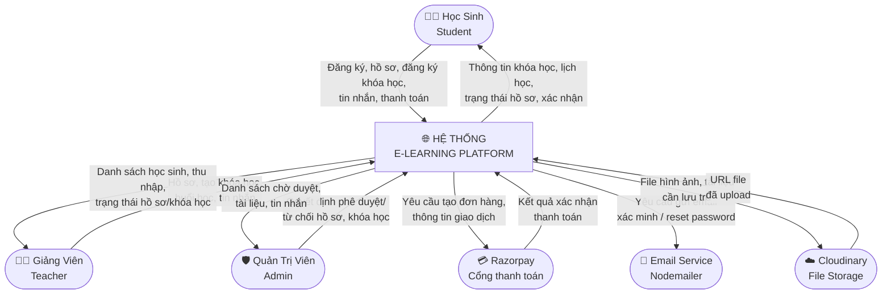
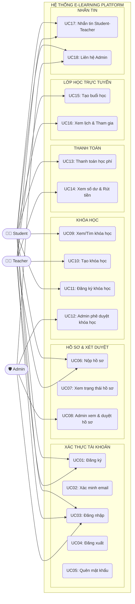
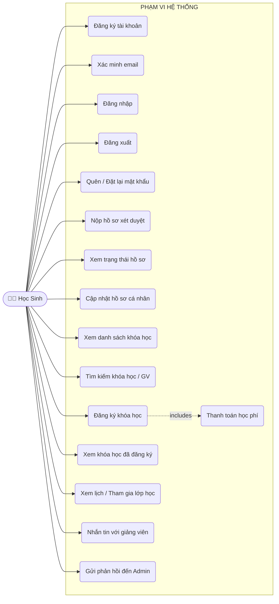
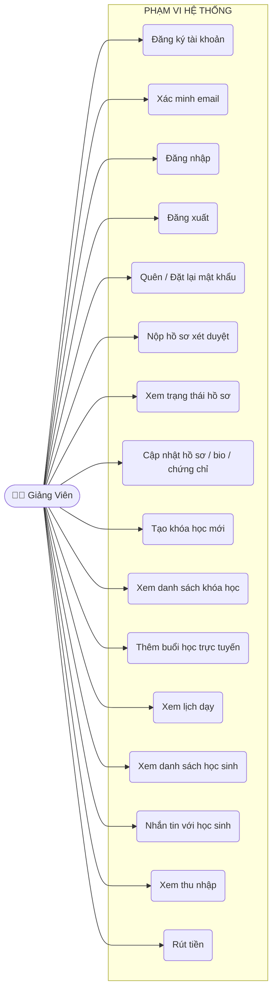
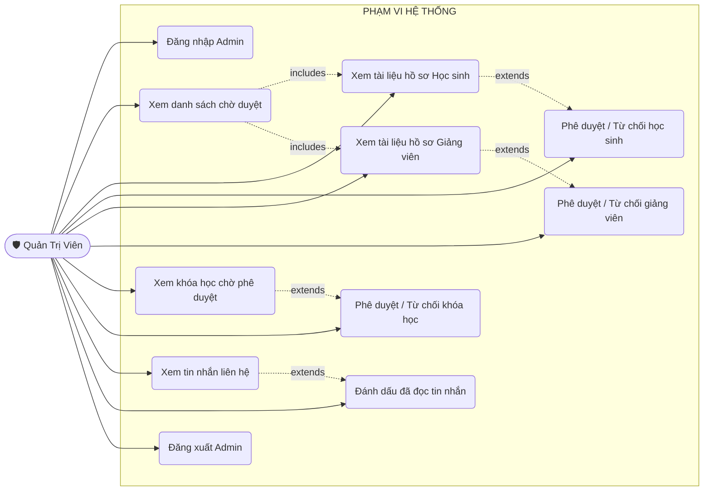
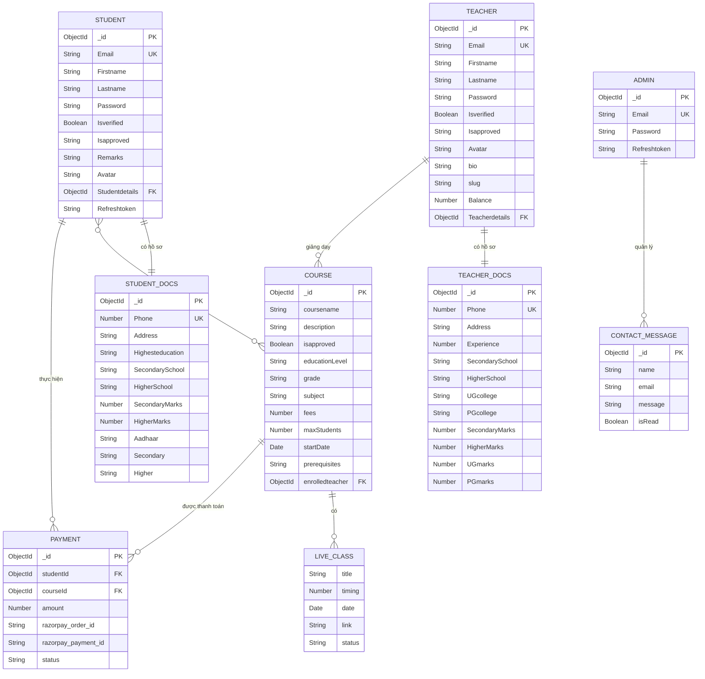

# 📚 TÀI LIỆU ĐẶC TẢ HỆ THỐNG
# E-LEARNING PLATFORM — NỀN TẢNG HỌC TRỰC TUYẾN

> **Phiên bản:** 1.0  
> **Ngày lập:** 21/09/2026  
> **Công nghệ:** MERN Stack (MongoDB, Express.js, React + Vite, Node.js)  
> **Loại hệ thống:** Ứng dụng Web học trực tuyến (Online Learning Platform)

---

## MỤC LỤC

1. [Lý do ra đời của ứng dụng](#1-lý-do-ra-đời-của-ứng-dụng)
2. [Các chức năng của phần mềm](#2-các-chức-năng-của-phần-mềm)
3. [Sơ đồ ngữ cảnh của phần mềm](#3-sơ-đồ-ngữ-cảnh-của-phần-mềm)
4. [Sơ đồ Use Case tổng quát](#4-sơ-đồ-use-case-tổng-quát)
5. [Đặc tả Use Case chi tiết](#5-đặc-tả-use-case-chi-tiết)
6. [Mô hình dữ liệu](#6-mô-hình-dữ-liệu)

---

## 1. LÝ DO RA ĐỜI CỦA ỨNG DỤNG

### 1.1 Bối cảnh và vấn đề thực tiễn

Trong thời đại công nghệ số bùng nổ, nhu cầu học tập và nâng cao kiến thức ngày càng tăng cao, đặc biệt sau đại dịch COVID-19 khi việc học trực tiếp bị gián đoạn nghiêm trọng. Thực trạng giáo dục hiện nay đặt ra nhiều thách thức:

| Vấn đề | Mô tả |
|--------|-------|
| **Giới hạn địa lý** | Học sinh/sinh viên ở vùng sâu, vùng xa không có cơ hội tiếp cận giáo viên chất lượng cao |
| **Chi phí cao** | Học phí tại các trung tâm gia sư truyền thống đắt đỏ, không phù hợp với đông đảo học sinh |
| **Thiếu linh hoạt thời gian** | Lịch học cố định không phù hợp với người đi làm hoặc có lịch bận rộn |
| **Khó kiểm soát chất lượng** | Không có cơ chế xác minh năng lực giảng viên, dễ dẫn đến lừa đảo |
| **Thiếu nền tảng tập trung** | Không có một nơi duy nhất để học sinh tìm kiếm, đăng ký và theo dõi khóa học |
| **Kết nối thầy-trò hạn chế** | Sau giờ học, học sinh khó liên lạc với giáo viên để được hỗ trợ thêm |

### 1.2 Giải pháp của ứng dụng

**E-Learning Platform** ra đời nhằm giải quyết các vấn đề trên bằng cách xây dựng một **nền tảng học trực tuyến toàn diện**, kết nối giảng viên và học sinh thông qua không gian số, với các đặc điểm nổi bật:

- **Xác minh danh tính & năng lực** — Hệ thống xét duyệt hồ sơ giảng viên bởi quản trị viên, đảm bảo chất lượng giảng dạy
- **Học mọi lúc, mọi nơi** — Giao diện web responsive, truy cập 24/7 từ bất kỳ thiết bị nào
- **Lớp học trực tuyến thời gian thực** — Tích hợp video conferencing cho phép tương tác trực tiếp thầy-trò
- **Thanh toán an toàn** — Cổng thanh toán Razorpay được tích hợp, đảm bảo giao dịch bảo mật
- **Hệ thống tin nhắn nội bộ** — Học sinh và giảng viên có thể liên lạc trực tiếp trong nền tảng
- **Quản lý khóa học đa cấp** — Phân loại khóa học theo cấp học (Tiểu học → Đại học), lớp và môn học

### 1.3 Đối tượng sử dụng mục tiêu

```
+------------------+----------------------------------------+
| ĐỐI TƯỢNG       | MÔ TẢ                                  |
+------------------+----------------------------------------+
| HỌC SINH        | Học sinh từ tiểu học đến đại học,       |
| (Student)        | người đi làm muốn học thêm kỹ năng      |
+------------------+----------------------------------------+
| GIẢNG VIÊN      | Giáo viên, gia sư, chuyên gia muốn     |
| (Teacher)        | chia sẻ kiến thức và tạo thu nhập       |
+------------------+----------------------------------------+
| QUẢN TRỊ VIÊN  | Nhân viên nền tảng quản lý nội dung,   |
| (Admin)          | xét duyệt hồ sơ, kiểm soát chất lượng  |
+------------------+----------------------------------------+
```

---

## 2. CÁC CHỨC NĂNG CỦA PHẦN MỀM

### 2.1 Chức năng chung (Tất cả người dùng)

| STT | Mã CN | Chức năng | Mô tả |
|-----|-------|-----------|-------|
| 1 | CN01 | Đăng ký tài khoản | Tạo tài khoản mới với email và mật khẩu |
| 2 | CN02 | Xác minh email | Xác nhận địa chỉ email qua link gửi về hộp thư |
| 3 | CN03 | Đăng nhập | Xác thực bằng JWT (Access Token + Refresh Token) |
| 4 | CN04 | Đăng xuất | Hủy phiên đăng nhập, xóa token |
| 5 | CN05 | Quên mật khẩu | Gửi email đặt lại mật khẩu (hết hạn sau 15 phút) |
| 6 | CN06 | Đặt lại mật khẩu | Nhập mật khẩu mới qua token hợp lệ |
| 7 | CN07 | Xem danh sách khóa học | Duyệt tất cả khóa học đã được phê duyệt |
| 8 | CN08 | Xem hồ sơ giảng viên | Xem thông tin công khai (bio, chứng chỉ, khóa học) |
| 9 | CN09 | Liên hệ hệ thống | Gửi tin nhắn phản hồi/khiếu nại đến Admin |

### 2.2 Chức năng dành cho Học sinh (Student)

| STT | Mã CN | Chức năng | Mô tả |
|-----|-------|-----------|-------|
| 10 | CN10 | Nộp hồ sơ xét duyệt | Upload giấy tờ xác minh (CMND/CCCD, bằng cấp) |
| 11 | CN11 | Xem trạng thái xét duyệt | Theo dõi: pending / approved / rejected / reupload |
| 12 | CN12 | Cập nhật hồ sơ cá nhân | Chỉnh sửa thông tin, ảnh đại diện |
| 13 | CN13 | Tìm kiếm khóa học | Tìm theo tên, cấp học, môn học |
| 14 | CN14 | Tìm kiếm giảng viên | Tìm và xem chi tiết hồ sơ giảng viên |
| 15 | CN15 | Đăng ký khóa học | Đăng ký tham gia (miễn phí hoặc trả phí) |
| 16 | CN16 | Thanh toán học phí | Thanh toán trực tuyến qua Razorpay |
| 17 | CN17 | Xem khóa học đã đăng ký | Danh sách tất cả khóa học đang tham gia |
| 18 | CN18 | Xem lịch học / buổi học | Xem danh sách buổi học trực tuyến sắp tới |
| 19 | CN19 | Tham gia lớp học trực tuyến | Truy cập link video conferencing |
| 20 | CN20 | Nhắn tin với giảng viên | Gửi/nhận tin nhắn riêng với giảng viên |

### 2.3 Chức năng dành cho Giảng viên (Teacher)

| STT | Mã CN | Chức năng | Mô tả |
|-----|-------|-----------|-------|
| 21 | CN21 | Nộp hồ sơ xét duyệt | Upload hồ sơ (CMND, bằng THPT, ĐH, Sau ĐH) |
| 22 | CN22 | Cập nhật hồ sơ cá nhân | Chỉnh sửa thông tin, bio, ảnh, chứng chỉ |
| 23 | CN23 | Tạo khóa học mới | Tạo khóa với tên, mô tả, cấp học, lịch, học phí |
| 24 | CN24 | Xem danh sách khóa học | Quản lý tất cả khóa học đang giảng dạy |
| 25 | CN25 | Thêm buổi học trực tuyến | Tạo lịch buổi học kèm link video, thời gian |
| 26 | CN26 | Xem danh sách học sinh | Theo dõi học sinh đã đăng ký |
| 27 | CN27 | Xem lịch dạy | Quản lý lịch dạy theo tuần/buổi |
| 28 | CN28 | Nhắn tin với học sinh | Giao tiếp trực tiếp với học sinh |
| 29 | CN29 | Xem thu nhập | Xem số dư tài khoản từ học phí nhận được |
| 30 | CN30 | Rút tiền | Yêu cầu rút số dư về tài khoản ngân hàng |

### 2.4 Chức năng dành cho Quản trị viên (Admin)

| STT | Mã CN | Chức năng | Mô tả |
|-----|-------|-----------|-------|
| 31 | CN31 | Đăng nhập Admin | Xác thực qua tài khoản quản trị riêng biệt |
| 32 | CN32 | Xem danh sách chờ xét duyệt | Xem hồ sơ học sinh/giảng viên đang chờ duyệt |
| 33 | CN33 | Xem tài liệu hồ sơ học sinh | Kiểm tra giấy tờ nộp lên của học sinh |
| 34 | CN34 | Phê duyệt / Từ chối học sinh | Cập nhật trạng thái xét duyệt học sinh |
| 35 | CN35 | Xem tài liệu hồ sơ giảng viên | Kiểm tra bằng cấp của giảng viên |
| 36 | CN36 | Phê duyệt / Từ chối giảng viên | Cập nhật trạng thái xét duyệt giảng viên |
| 37 | CN37 | Xem khóa học chờ phê duyệt | Danh sách khóa học do giảng viên tạo |
| 38 | CN38 | Phê duyệt / Từ chối khóa học | Cho phép/từ chối khóa học xuất hiện trên nền tảng |
| 39 | CN39 | Xem tin nhắn liên hệ | Đọc phản hồi, khiếu nại từ người dùng |
| 40 | CN40 | Đánh dấu đã đọc tin nhắn | Cập nhật trạng thái đọc tin nhắn liên hệ |
| 41 | CN41 | Đăng xuất Admin | Kết thúc phiên làm việc quản trị |

### 2.5 Phân cấp chức năng tổng thể

```
E-LEARNING PLATFORM
|
|-- XAC THUC & TAI KHOAN
|   |-- Dang ky / Xac minh email / Dang nhap / Dang xuat
|   `-- Quen mat khau / Dat lai mat khau
|
|-- XET DUYET HO SO
|   |-- Nop ho so (Student / Teacher)
|   `-- Admin xet duyet: Approved / Rejected / Reupload
|
|-- QUAN LY KHOA HOC
|   |-- Tao khoa hoc (Teacher) --> Admin phe duyet
|   |-- Duyet/Tim kiem khoa hoc (Student/Public)
|   `-- Phan cap: Cap hoc --> Lop --> Mon hoc
|
|-- THANH TOAN
|   |-- Dang ky khoa hoc tra phi (Razorpay)
|   |-- Xac nhan thanh toan
|   `-- Teacher: Xem so du / Rut tien
|
|-- LOP HOC TRUC TUYEN
|   |-- Teacher tao buoi hoc (link, thoi gian, trang thai)
|   `-- Student tham gia qua link video conferencing
|
|-- NHAN TIN & LIEN LAC
|   |-- Nhan tin Student <--> Teacher
|   `-- Lien he Admin qua form Contact Us
|
`-- HO SO CA NHAN
    |-- Student: Cap nhat thong tin, anh dai dien
    `-- Teacher: Cap nhat bio, chung chi, anh dai dien
```

---

## 3. SƠ ĐỒ NGỮ CẢNH CỦA PHẦN MỀM

### 3.1 Sơ đồ ngữ cảnh (Context Diagram - Level 0)

```
                    +------------------------------------------+
                    |                                          |
                    |      HE THONG E-LEARNING PLATFORM       |
    [HOC SINH] <----|---- Thong tin khoa hoc, lich hoc,        |
        |      ---->|     tin nhan, trang thai ho so           |
        |           |                                          |
    [GIANG VIEN]<---|---- Danh sach hoc sinh, thu nhap,        |
        |       --->|     trang thai khoa hoc/ho so            |
        |           |                                          |
    [ADMIN]    <----|---- Danh sach cho duyet, tai lieu,       |
        |       --->|     tin nhan lien he                     |
        |           |                                          |
    [RAZORPAY] <----|---- Ket qua xac nhan thanh toan          |
                --->|     Yeu cau tao don hang                 |
                    |                                          |
    [EMAIL SVC] <---|---- Yeu cau gui email (xac minh/reset)   |
                    |                                          |
    [CLOUDINARY]<---|---- URL file da luu tru                  |
                --->|     File anh, tai lieu can upload        |
                    +------------------------------------------+
```

### 3.2 Mô tả Sơ đồ ngữ cảnh (DFD Level 0)



### 3.3 Mô tả các luồng dữ liệu ngữ cảnh

| Tác nhân | Luồng vào hệ thống | Luồng ra từ hệ thống |
|----------|--------------------|----------------------|
| **Học sinh** | Thông tin đăng ký, hồ sơ, yêu cầu đăng ký khóa học, thanh toán, tin nhắn | Thông tin khóa học, lịch học, trạng thái hồ sơ, xác nhận thanh toán |
| **Giảng viên** | Hồ sơ, thông tin khóa học mới, lịch buổi học, tin nhắn | Danh sách học sinh, thu nhập, trạng thái hồ sơ/khóa học |
| **Quản trị viên** | Quyết định phê duyệt/từ chối hồ sơ, khóa học | Danh sách hồ sơ chờ duyệt, giấy tờ, tin nhắn liên hệ |
| **Razorpay** | Kết quả xác nhận thanh toán | Yêu cầu tạo đơn hàng, thông tin giao dịch |
| **Email Service** | Trạng thái gửi email | Yêu cầu gửi email xác minh / đặt lại mật khẩu |
| **Cloudinary** | URL file đã lưu | File hình ảnh, tài liệu cần upload |

---

## 4. SƠ ĐỒ USE CASE TỔNG QUÁT

### 4.1 Use Case tổng quát — Toàn hệ thống



### 4.2 Use Case chi tiết — Học sinh (Student)



### 4.3 Use Case chi tiết — Giảng viên (Teacher)



### 4.4 Use Case chi tiết — Quản trị viên (Admin)



---

## 5. ĐẶC TẢ USE CASE CHI TIẾT

### UC-11 — Đăng ký khóa học

| Trường | Nội dung |
|--------|----------|
| **Tên Use Case** | Đăng ký khóa học |
| **Mã** | UC-11 |
| **Tác nhân chính** | Học sinh (Student) |
| **Điều kiện tiên quyết** | Học sinh đã đăng nhập và được phê duyệt (Isapproved = "approved") |
| **Điều kiện kết thúc** | Học sinh được thêm vào danh sách `enrolledStudent` của khóa học |
| **Luồng chính** | 1. Học sinh duyệt danh sách khóa học<br>2. Học sinh chọn khóa học muốn đăng ký<br>3. Hệ thống kiểm tra điều kiện đăng ký (đã đăng ký chưa, còn chỗ không)<br>4a. Nếu khóa học miễn phí → Thêm trực tiếp vào danh sách<br>4b. Nếu khóa học tính phí → Chuyển sang UC-13 (Thanh toán)<br>5. Hệ thống xác nhận đăng ký thành công |
| **Luồng thay thế** | 3a. Học sinh đã đăng ký → Thông báo "Bạn đã đăng ký khóa học này"<br>3b. Khóa học đầy chỗ → Thông báo không thể đăng ký |
| **Ngoại lệ** | Học sinh chưa được phê duyệt → Redirect sang trang thông báo |

---

### UC-10 — Tạo khóa học mới (Teacher)

| Trường | Nội dung |
|--------|----------|
| **Tên Use Case** | Tạo khóa học mới |
| **Mã** | UC-10 |
| **Tác nhân chính** | Giảng viên (Teacher) |
| **Điều kiện tiên quyết** | Giảng viên đã đăng nhập và được phê duyệt |
| **Điều kiện kết thúc** | Khóa học được tạo với `isapproved = false`, chờ Admin duyệt |
| **Luồng chính** | 1. Giảng viên chọn "Tạo khóa học mới"<br>2. Điền thông tin: tên, mô tả, cấp học, lớp, môn học, học phí, lịch học, syllabus, kết quả đầu ra, điều kiện tham gia<br>3. Xác nhận tạo khóa học<br>4. Hệ thống lưu với `isapproved = false`<br>5. Thông báo "Khóa học đang chờ Admin phê duyệt" |
| **Luồng thay thế** | 3a. Thiếu thông tin bắt buộc → Thông báo lỗi validation |
| **Ngoại lệ** | Giảng viên chưa được phê duyệt → Không có quyền tạo khóa học |

---

### UC-08 — Phê duyệt hồ sơ (Admin)

| Trường | Nội dung |
|--------|----------|
| **Tên Use Case** | Phê duyệt / Từ chối hồ sơ người dùng |
| **Mã** | UC-08 |
| **Tác nhân chính** | Quản trị viên (Admin) |
| **Điều kiện tiên quyết** | Admin đã đăng nhập |
| **Điều kiện kết thúc** | Hồ sơ người dùng được cập nhật trạng thái mới |
| **Luồng chính** | 1. Admin vào danh sách hồ sơ chờ duyệt<br>2. Xem tài liệu hồ sơ (CMND, bằng cấp)<br>3. Quyết định: Phê duyệt / Từ chối / Yêu cầu upload lại<br>4. Hệ thống cập nhật trạng thái Isapproved<br>5. Người dùng nhận kết quả khi đăng nhập lại |
| **Luồng thay thế** | 3a. Yêu cầu reupload → Ghi chú lý do (Remarks) |
| **Ngoại lệ** | Hồ sơ không tồn tại → Trả về lỗi 404 |

---

### UC-13 — Thanh toán học phí

| Trường | Nội dung |
|--------|----------|
| **Tên Use Case** | Thanh toán học phí |
| **Mã** | UC-13 |
| **Tác nhân chính** | Học sinh (Student) |
| **Tác nhân thứ hai** | Razorpay (cổng thanh toán) |
| **Điều kiện tiên quyết** | Học sinh đã chọn khóa học tính phí |
| **Điều kiện kết thúc** | Thanh toán thành công, học sinh được thêm vào khóa học, số dư giảng viên tăng |
| **Luồng chính** | 1. Hệ thống tạo đơn hàng Razorpay<br>2. Học sinh điền thông tin thanh toán<br>3. Razorpay xử lý giao dịch<br>4. Razorpay trả về kết quả thành công<br>5. Hệ thống xác nhận và ghi nhận thanh toán<br>6. Học sinh được đăng ký vào khóa học |
| **Luồng thay thế** | 4a. Giao dịch thất bại → Thông báo lỗi, không đăng ký khóa học |
| **Ngoại lệ** | Timeout kết nối Razorpay → Giao dịch bị hủy |

---

### UC-15 — Tạo buổi học trực tuyến (Teacher)

| Trường | Nội dung |
|--------|----------|
| **Tên Use Case** | Tạo buổi học trực tuyến |
| **Mã** | UC-15 |
| **Tác nhân chính** | Giảng viên (Teacher) |
| **Điều kiện tiên quyết** | Giảng viên đã đăng nhập, đã có ít nhất 1 khóa học được duyệt |
| **Điều kiện kết thúc** | Buổi học được thêm vào `liveClasses[]` của khóa học |
| **Luồng chính** | 1. Giảng viên vào khóa học cụ thể<br>2. Chọn "Thêm buổi học mới"<br>3. Điền thông tin: tiêu đề, ngày giờ, link video, thời lượng<br>4. Xác nhận tạo buổi học<br>5. Hệ thống lưu với status = "upcoming"<br>6. Học sinh đã đăng ký có thể thấy buổi học trong lịch |
| **Luồng thay thế** | 3a. Thiếu link video → Thông báo lỗi |
| **Ngoại lệ** | Khóa học không tồn tại → Lỗi 404 |

---

## 6. MÔ HÌNH DỮ LIỆU

### 6.1 Sơ đồ ERD (Entity Relationship Diagram)



### 6.2 Mô tả các thực thể chính

| Thực thể | Vai trò | Trường quan trọng |
|----------|---------|-------------------|
| **STUDENT** | Học sinh sử dụng nền tảng | Isapproved (pending/approved/rejected/reupload) |
| **TEACHER** | Giảng viên tạo và giảng dạy khóa học | Balance (thu nhập), enrolledStudent[] |
| **COURSE** | Khóa học trên nền tảng | isapproved, educationLevel, liveClasses[], schedule[] |
| **PAYMENT** | Ghi nhận giao dịch thanh toán | razorpay_order_id, razorpay_payment_id |
| **STUDENT_DOCS** | Hồ sơ, giấy tờ học sinh | Aadhaar, Secondary, Higher (file URLs) |
| **TEACHER_DOCS** | Hồ sơ, bằng cấp giảng viên | Aadhaar, Secondary, Higher, UG, PG (file URLs) |
| **ADMIN** | Quản trị viên hệ thống | Email, Password |
| **CONTACT_MESSAGE** | Tin nhắn liên hệ từ người dùng | isRead (trạng thái đọc) |

---

## PHỤ LỤC A — CÔNG NGHỆ SỬ DỤNG

| Layer | Công nghệ | Mục đích |
|-------|-----------|----------|
| **Frontend** | React 18 + Vite | Giao diện người dùng động, responsive |
| **Routing** | React Router DOM | Điều hướng phía client |
| **State** | React Context API | Quản lý trạng thái toàn cục |
| **Backend** | Node.js + Express.js | Server-side API RESTful |
| **Database** | MongoDB + Mongoose | Lưu trữ dữ liệu NoSQL |
| **Authentication** | JWT + bcrypt | Xác thực và mã hóa mật khẩu |
| **File Storage** | Cloudinary + Multer | Lưu trữ file, hình ảnh, tài liệu |
| **Payment** | Razorpay | Cổng thanh toán trực tuyến |
| **Email** | Nodemailer | Gửi email xác minh, reset password |
| **Validation** | Joi | Kiểm tra dữ liệu đầu vào |
| **Deployment** | Vercel | Triển khai frontend và backend |

## PHỤ LỤC B — TRẠNG THÁI HỒ SƠ

```
Người dùng đăng ký
        |
        v
    [pending] -----> Admin xem xét
                          |
               +----------+----------+
               |          |          |
               v          v          v
          [approved]  [rejected]  [reupload]
               |                    |
               v                    v
         Truy cập đầy       Người dùng upload
         đủ tính năng       lại và chờ duyệt
```

## PHỤ LỤC C — QUY TRÌNH PHÊ DUYỆT KHÓA HỌC

```
Giảng viên tạo khóa học
        |
        v
    isapproved = false (chờ duyệt)
        |
        v
    Admin xem xét
        |
        +------> Phê duyệt: isapproved = true
        |           |
        |           v
        |       Khóa học xuất hiện trên trang công khai
        |
        +------> Từ chối: isapproved = false (giữ nguyên)
                    |
                    v
                Khóa học không hiển thị
```

---

*Tài liệu được tạo tự động từ phân tích mã nguồn dự án e-Learning-Platform*  
*Cập nhật lần cuối: 21/09/2026*
