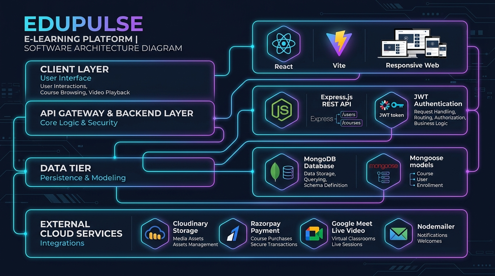
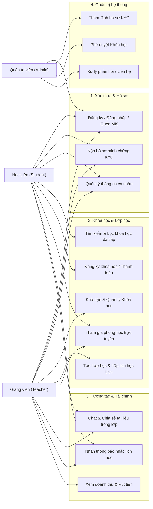
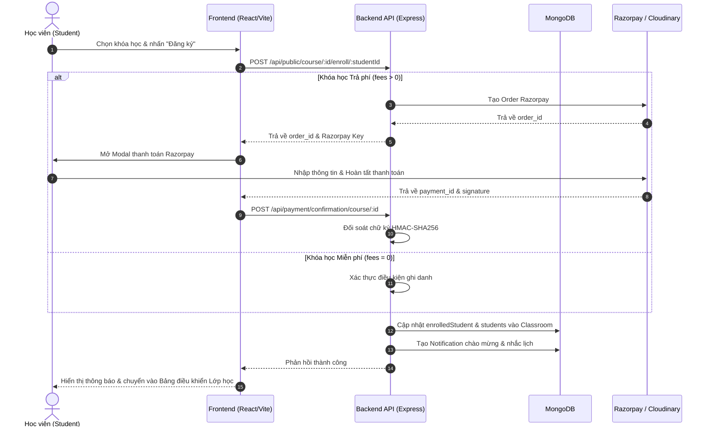
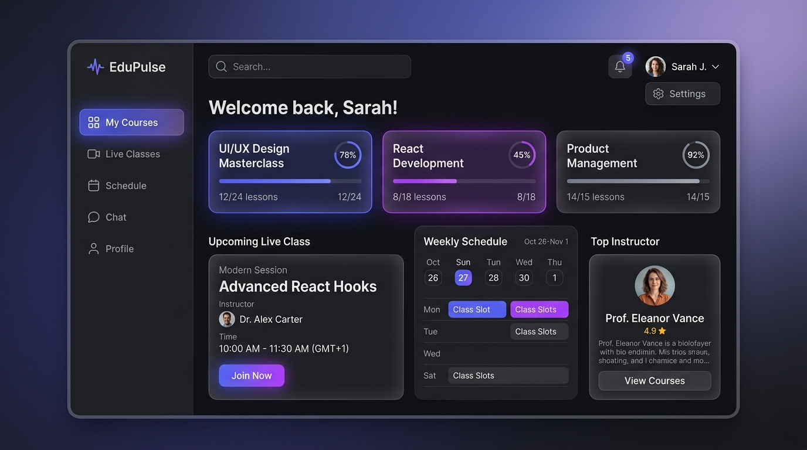
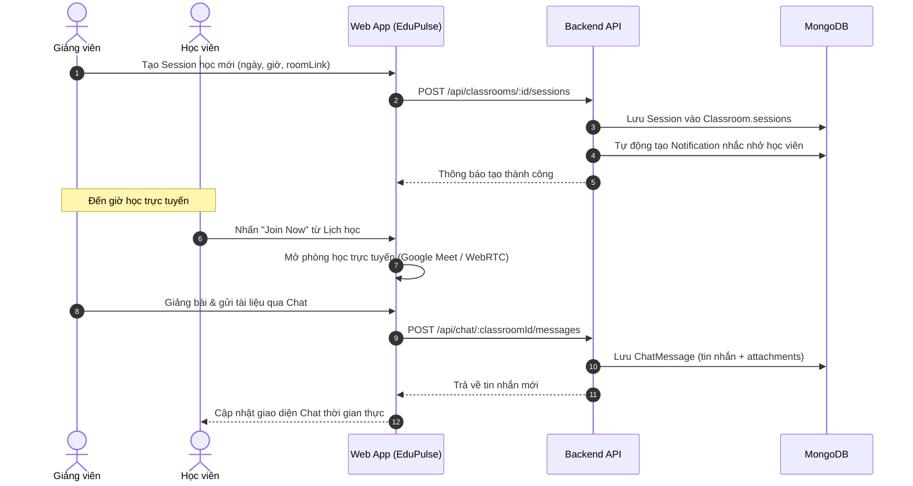
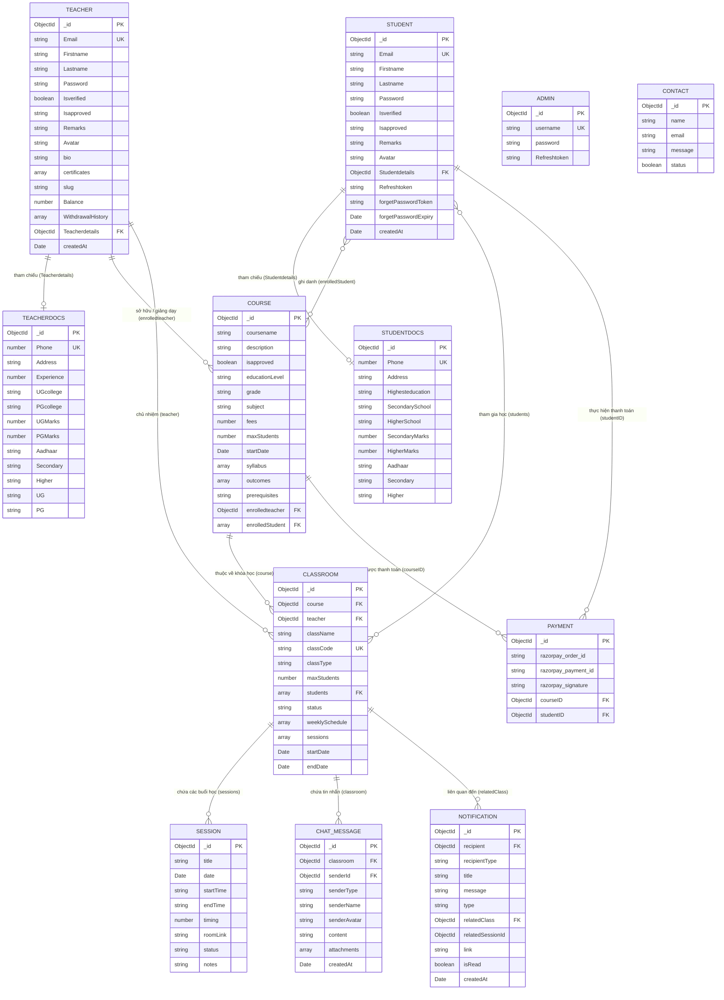

# TÀI LIỆU ĐẶC TẢ YÊU CẦU HỆ THỐNG (SRS)
# HỆ THỐNG NỀN TẢNG HỌC TRỰC TUYẾN EDUPULSE (ONLINE LEARNING PLATFORM)

---

## Table of Contents (Mục lục)

1. **Introduction**
   - 1.1 Purpose
   - 1.2 Document Conventions
   - 1.3 Project Scope
   - 1.4 References
2. **System Description**
3. **Functional Requirements**
   - 3.1 System Features
     - 3.1.1 Xác thực người dùng và Phân quyền (Authentication & Authorization)
     - 3.1.2 Hồ sơ cá nhân và Xác minh danh tính KYC (Document Verification)
     - 3.1.3 Quản lý Khóa học đa cấp (Course Management)
     - 3.1.4 Quản lý Lớp học trực tuyến (Classroom & Live Sessions)
     - 3.1.5 Kênh trao đổi lớp học (Classroom Chat)
     - 3.1.6 Hệ thống Thông báo và Nhắc lịch học (Notification System)
     - 3.1.7 Thanh toán và Quản lý dòng tiền giảng viên (Payment & Balance Withdrawal)
     - 3.1.8 Quản trị hệ thống và Hỗ trợ khách hàng (Admin & Support Management)
   - 3.2 Use Cases
     - 3.2.1 Use Case Diagrams
     - 3.2.2 Use Case 1: Học viên đăng ký khóa học và tham gia lớp học
     - 3.2.3 Use Case 2: Giảng viên khởi tạo lớp học và tổ chức buổi học trực tuyến
     - 3.2.4 Use Case 3: Quản trị viên thẩm định hồ sơ và phê duyệt khóa học
     - 3.2.5 Sơ đồ Tuần tự (Sequence Diagrams)
   - 3.3 Entity Relationship Diagrams (ERD)
   - 3.4 Data Dictionary
     - 3.4.1 Thực thể Người dùng (Student, Teacher, Admin) & Hồ sơ KYC
     - 3.4.2 Thực thể Khóa học & Lớp học (Course, Classroom, Session)
     - 3.4.3 Thực thể Tương tác & Tài chính (ChatMessage, Notification, Payment, Contact)
4. **External Interface Requirements**
   - 4.1 User Interfaces (UI)
   - 4.2 Hardware Interfaces
   - 4.3 Software Interfaces
   - 4.4 Communication & Network Interfaces
5. **Technical Requirements (Non-functional)**
   - 5.1 Performance
   - 5.2 Scalability
   - 5.3 Security
   - 5.4 Maintainability
   - 5.5 Usability
   - 5.6 Multi lingual Support
   - 5.7 Auditing and Logging
   - 5.8 Availability
6. **Open Issues**
7. **Appendix: Installation & Deployment Guide**
   - 7.1 Thông tin Mã nguồn (Repository Information)
   - 7.2 Yêu cầu Môi trường (Prerequisites)
   - 7.3 Hướng dẫn Cài đặt & Khởi chạy chi tiết (Step-by-step Setup)
   - 7.4 Tài khoản Đăng nhập Thử nghiệm (Test Credentials)

---

## 1. Introduction

### 1.1 Purpose
Tài liệu này xác định đầy đủ và chi tiết các yêu cầu chức năng (Functional Requirements), phi chức năng (Non-Functional Requirements), thiết kế kiến trúc dữ liệu và giao diện cho dự án **EduPulse** (Nền tảng e-Learning tích hợp lớp học trực tuyến và kết nối Giảng viên – Học viên). Tài liệu phục vụ cho đội ngũ phát triển, kiểm thử, quản trị dự án và hội đồng đánh giá nhằm nắm bắt chuẩn hóa kỹ thuật trong suốt vòng đời phần mềm.

### 1.2 Document Conventions
- **MUST / SHALL / REQUIRED**: Các yêu cầu bắt buộc phải đáp ứng.
- **SHOULD / RECOMMENDED**: Các tính năng khuyến nghị áp dụng để nâng cao trải nghiệm người dùng hoặc hiệu năng.
- **MAY / OPTIONAL**: Các tính năng mở rộng có thể cân nhắc triển khai trong các giai đoạn sau.
- Quy ước ký hiệu thực thể dữ liệu tuân thủ chuẩn mô hình hóa NoSQL Mongoose Schema trên cơ sở dữ liệu MongoDB.

### 1.3 Project Scope
Dự án **EduPulse** là giải pháp nền tảng Giáo dục trực tuyến xây dựng trên kiến trúc **MERN Stack** (MongoDB, Express.js, React, Node.js), kết hợp Vite, Tailwind CSS và RESTful API. Hệ thống hỗ trợ 3 nhóm đối tượng người dùng chính:
1. **Học viên (Student)**: Tìm kiếm môn học theo phân cấp chuẩn (Tiểu học, THCS, THPT, Đại học, Ngoại ngữ), xem hồ sơ giảng viên, đăng ký khóa học, vào lớp học trực tuyến, chat trao đổi tài liệu và nhận nhắc nhở lịch học.
2. **Giảng viên (Teacher)**: Nộp hồ sơ xét duyệt năng lực (KYC), khởi tạo khóa học/lớp học (lớp nhóm hoặc 1-kèm-1), lên lịch học trực tiếp (Google Meet/WebRTC), quản lý học viên, nhắn tin và rút tiền học phí.
3. **Quản trị viên (Admin)**: Thẩm định hồ sơ bằng cấp/giấy tờ tùy thân của học viên & giảng viên, kiểm duyệt chất lượng nội dung khóa học trước khi công khai, và phản hồi thư liên hệ hỗ trợ.

### 1.4 References
- Kho lưu trữ mã nguồn GitHub: [https://github.com/manhnguyen270724-sudo/EduPulse.git](https://github.com/manhnguyen270724-sudo/EduPulse.git)
- Tài liệu gốc tham khảo dự án: [https://code2tutorial.com/tutorial/55a23a94-6cb7-4c48-92c1-f96db207f791/index.md](https://code2tutorial.com/tutorial/55a23a94-6cb7-4c48-92c1-f96db207f791/index.md)
- Tiêu chuẩn bảo mật xác thực: JSON Web Token (RFC 7519), Bcrypt Hashing, HttpOnly Cookie.

---

## 2. System Description

Hệ thống EduPulse được cấu trúc theo mô hình phân tầng **Client - Server**:
- **Frontend (Client Tier)**: Ứng dụng Single Page Application (SPA) xây dựng bằng **React 18** và **Vite 5**, chia tách route dạng Lazy-loading kết hợp bảo vệ tuyến đường (`ProtectedRoute`), sử dụng TailwindCSS và CSS Animations hiện đại.
- **Backend (API Tier)**: Xây dựng bằng **Node.js** và **Express.js**, quản lý các tuyến API theo tài nguyên: `/api/student`, `/api/teacher`, `/api/admin`, `/api/course`, `/api/classrooms`, `/api/chat`, `/api/notifications`, `/api/payment`, `/api/public`.
- **Database Tier**: Cơ sở dữ liệu hướng tài liệu **MongoDB** (thông qua **Mongoose 8**), hỗ trợ lưu trữ phi cấu trúc, đánh index tối ưu và phân trang bằng `mongoose-aggregate-paginate-v2`.
- **Cloud & Dịch vụ tích hợp bên thứ ba**:
  - **Cloudinary**: Lưu trữ hồ sơ, bằng cấp chứng chỉ, hình ảnh đại diện và tệp đính kèm.
  - **Razorpay**: Cổng thanh toán trực tuyến xử lý học phí cho khóa học trả phí.
  - **Nodemailer**: Dịch vụ gửi email xác thực kích hoạt tài khoản và gửi mã đặt lại mật khẩu.
  - **Nền tảng Hội nghị trực tuyến**: Tích hợp liên kết phòng học trực tiếp (Google Meet / WebRTC).



---

## 3. Functional Requirements

### 3.1 System Features

#### 3.1.1 Xác thực người dùng và Phân quyền (Authentication & Authorization)
- **Đăng ký tài khoản (Sign-up)**: Cho phép Học viên và Giảng viên đăng ký tài khoản mới bằng Email, Họ tên và Mật khẩu. Mật khẩu được mã hóa tự động bằng Bcrypt (salt round = 10).
- **Kích hoạt tài khoản qua Email (Email Verification)**: Sau khi đăng ký, hệ thống gửi email xác nhận. Tài khoản chỉ được kích hoạt (`Isverified = true`) khi người dùng nhấp vào link hợp lệ.
- **Đăng nhập (Login)**: Kiểm tra thông tin đăng nhập, xác thực bằng JWT (tạo cặp `accessToken` và `refreshToken`). Đăng nhập Admin tách biệt qua tuyến `/adminLogin`.
- **Bảo vệ phiên làm việc (Session & Cookie Management)**: Sử dụng HttpOnly Cookies kết hợp API đồng bộ trạng thái `/api/public/verify-session`.
- **Quên và Đặt lại mật khẩu (Password Reset Flow)**: Phát sinh mã token ngẫu nhiên sha256 có thời hạn 15 phút và gửi qua email để thiết lập lại mật khẩu an toàn.

#### 3.1.2 Hồ sơ cá nhân và Xác minh danh tính KYC (Document Verification)
- **Hồ sơ học viên (Student KYC)**: Tải lên căn cước/giấy khai sinh (`Aadhaar`), học bạ phổ thông (`Secondary`, `Higher`) và điểm trung bình.
- **Hồ sơ giảng viên (Teacher KYC & Public Profile)**: Tải lên bằng cấp đại học/thạc sĩ (`UG`, `PG`), bảng điểm, số năm kinh nghiệm, giới thiệu bản thân (`bio`) và danh sách chứng chỉ (`certificates`).
- **Quy trình xét duyệt trạng thái**: Gồm 4 trạng thái: `pending` (chờ duyệt), `approved` (đã duyệt), `reupload` (yêu cầu nộp lại), `rejected` (từ chối). Chỉ người dùng có trạng thái `approved` mới được mở đầy đủ tính năng giảng dạy hoặc học tập nâng cao.

#### 3.1.3 Quản lý Khóa học đa cấp (Course Management)
- **Phân loại 3 tầng chuẩn**:
  - **Cấp học (educationLevel)**: Tiểu học (`primary`), THCS (`secondary`), THPT (`highschool`), Ngoại ngữ (`language`), Đại học (`university`).
  - **Khối lớp (grade)**: Lớp 1 đến Lớp 12, hoặc Luyện thi (`on-thi`).
  - **Môn học (subject)**: Chuẩn hóa theo chương trình (Toán, Vật lý, Hóa học, Tiếng Anh,...).
- **Nội dung giáo trình (Syllabus)**: Biên soạn chi tiết theo từng chương (`chapter`) và mục tiêu đầu ra (`outcomes`).
- **Phê duyệt khóa học (Course Moderation)**: Khóa học do giảng viên tạo cần được Quản trị viên duyệt (`isapproved = true`) trước khi hiển thị trên trang chủ tìm kiếm.

#### 3.1.4 Quản lý Lớp học trực tuyến (Classroom & Live Sessions)
- **Hình thức lớp học**: Hỗ trợ 2 mô hình: Lớp học nhóm (`group`, tối đa 20 học viên) và Lớp kèm riêng (`one-on-one`, tối đa 1 học viên).
- **Mã lớp học tự động (Class Code)**: Tự động khởi tạo mã định danh duy nhất (ví dụ: `EP-GRP-5821` hoặc `EP-1ON1-9430`).
- **Thời khóa biểu & Buổi học (Sessions)**: Giảng viên thiết lập lịch học định kỳ trong tuần và tạo các buổi học cụ thể kèm thời gian bắt đầu, kết thúc, thời lượng (phút), ghi chú bài học và đường dẫn phòng học trực tiếp (`roomLink`).
- **Tổng hợp lịch cá nhân**: Cung cấp API lịch dạy cho giảng viên và lịch học cho học viên theo tuần/tháng.

#### 3.1.5 Kênh trao đổi lớp học (Classroom Chat)
- Mỗi lớp học sở hữu một phòng thảo luận độc lập.
- Giảng viên và học viên thuộc lớp có quyền gửi tin nhắn văn bản, chia sẻ tài liệu/bài tập qua tệp đính kèm (`attachments`).
- Tự động gắn nhãn vai trò người gửi (`senderType`: student/teacher) và lưu trữ mốc thời gian gửi.

#### 3.1.6 Hệ thống Thông báo và Nhắc lịch học (Notification System)
- **Cơ chế nhắc giờ học tự động**: Bộ xử lý `checkUpcomingClassReminders` quét các buổi học sắp diễn ra để gửi cảnh báo sớm đến học viên và giảng viên.
- **Phân loại thông báo**: Nhắc giờ học (`class_reminder`), tin nhắn mới trong lớp (`chat_message`), học viên mới đăng ký (`class_enrolled`) và thông báo hệ thống (`system`).
- **Giao diện chuông thông báo (NotificationBell)**: Hiển thị số lượng chưa đọc (`unreadCount`), hỗ trợ đánh dấu từng mục hoặc tất cả đã đọc.

#### 3.1.7 Thanh toán và Quản lý dòng tiền giảng viên (Payment & Balance Withdrawal)
- **Mua khóa học**: Tích hợp cổng thanh toán trực tuyến Razorpay với khóa học có thu phí; cung cấp cơ chế đăng ký miễn phí cho khóa học học phí = 0 (`fees = 0`).
- **Xác thực giao dịch an toàn**: Đối chiếu chữ ký bảo mật `razorpay_signature` trên Server trước khi cấp quyền truy cập khóa học cho học viên.
- **Ví tiền giảng viên (Teacher Balance)**: Tự động ghi nhận số dư khi có học viên ghi danh thành công.
- **Rút tiền (Withdrawal)**: Giảng viên có thể gửi yêu cầu rút tiền, hệ thống trừ số dư và lưu vết chi tiết vào `WithdrawalHistory`.

#### 3.1.8 Quản trị hệ thống và Hỗ trợ khách hàng (Admin & Support Management)
- **Kiểm tra minh chứng KYC**: Quản trị viên đối soát tài liệu gốc (ảnh thẻ căn cước, bằng cấp) được lưu trữ trên Cloudinary.
- **Chấp thuận/Từ chối**: Cập nhật trạng thái kèm nhận xét (`Remarks`) gửi phản hồi cho người dùng.
- **Hộp thư hỗ trợ (Contact Us)**: Tiếp nhận thắc mắc từ khách vãng lai, chuyển về trang điều hành Admin để xử lý và đánh dấu trạng thái giải quyết.

---

### 3.2 Use Cases

#### 3.2.1 Use Case Diagrams



#### 3.2.2 Use Case 1: Học viên đăng ký khóa học và tham gia lớp học
- **Tên Use Case**: Đăng ký và Tham gia Lớp học (Enroll & Attend Class).
- **Tác nhân chính (Actor)**: Học viên (Student).
- **Tiền điều kiện (Pre-conditions)**: Học viên đã đăng nhập và tài khoản đã được kích hoạt/duyệt hồ sơ.
- **Hậu điều kiện (Post-conditions)**: Học viên được thêm vào danh sách học viên của lớp, nhận thông báo nhắc lịch học và tham gia phòng học trực tiếp.
- **Luồng sự kiện chính (Basic Flow)**:
  1. Học viên duyệt danh sách khóa học tại `/courses` hoặc tìm kiếm theo cấp học, khối lớp và môn học.
  2. Học viên chọn khóa học cụ thể để xem chi tiết giáo trình, thông tin giảng viên và danh sách lớp mở.
  3. Học viên nhấn **"Đăng ký ngay"** (Enroll Now).
  4. Nếu khóa học có phí, hệ thống kích hoạt cổng thanh toán Razorpay; học viên hoàn tất giao dịch. Nếu khóa học miễn phí, hệ thống gọi API `enrollStudentFree`.
  5. Hệ thống xác nhận ghi danh, bổ sung `studentId` vào khóa học và danh sách lớp học.
  6. Học viên truy cập mục **Lịch học** trên Student Dashboard, nhận thông báo nhắc giờ học và bấm vào liên kết phòng học (`roomLink`) khi đến giờ.
- **Ngoại lệ (Alternative/Exception Flow)**:
  - Nếu giao dịch thanh toán thất bại, hệ thống hủy đăng ký và hiển thị thông báo lỗi.
  - Nếu lớp học đã đủ sĩ số tối đa (`maxStudents`), hệ thống ngăn chặn đăng ký và yêu cầu chọn lớp khác.

#### 3.2.3 Use Case 2: Giảng viên khởi tạo lớp học và tổ chức buổi học trực tuyến
- **Tên Use Case**: Quản lý Lớp học và Buổi học (Create Classroom & Manage Sessions).
- **Tác nhân chính (Actor)**: Giảng viên (Teacher).
- **Tiền điều kiện**: Giảng viên có tài khoản được Admin duyệt (`Isapproved = 'approved'`).
- **Hậu điều kiện**: Lớp học được tạo với mã lớp duy nhất, lịch học được cập nhật vào thời khóa biểu chung.
- **Luồng sự kiện chính**:
  1. Giảng viên vào **Teacher Dashboard -> Classrooms**, chọn nút **"Tạo lớp học mới"**.
  2. Giảng viên nhập tên lớp, chọn hình thức (Lớp nhóm hoặc 1-kèm-1), chọn khóa học liên kết, số lượng học viên tối đa và thiết lập thời khóa biểu cố định trong tuần (`weeklySchedule`).
  3. Hệ thống tạo mã lớp duy nhất (`classCode`) dạng `EP-GRP-xxxx` hoặc `EP-1ON1-xxxx`.
  4. Giảng viên khởi tạo buổi học cụ thể (`Session`) kèm chủ đề bài học, ngày, giờ bắt đầu, thời lượng và link phòng học (Google Meet).
  5. Giảng viên truy cập phòng chat của lớp để thông báo bài chuẩn bị cho học viên.
- **Ngoại lệ**:
  - Đối với hình thức 1-kèm-1, hệ thống khóa cứng sĩ số tối đa là 1 học viên.

#### 3.2.4 Use Case 3: Quản trị viên thẩm định hồ sơ và phê duyệt khóa học
- **Tên Use Case**: Kiểm duyệt Hồ sơ & Nội dung (Moderate KYC & Course).
- **Tác nhân chính (Actor)**: Quản trị viên (Admin).
- **Tiền điều kiện**: Quản trị viên đăng nhập thành công qua trang `/adminLogin`.
- **Hậu điều kiện**: Trạng thái người dùng hoặc khóa học được cập nhật; người dùng nhận được thông báo phản hồi.
- **Luồng sự kiện chính**:
  1. Quản trị viên xem danh sách học viên và giảng viên đang chờ duyệt tại bảng điều khiển.
  2. Bấm xem chi tiết hồ sơ tài liệu minh chứng (`VarifyDoc`).
  3. Kiểm tra ảnh chụp căn cước, bằng tốt nghiệp, chứng chỉ chuyên môn.
  4. Chọn một trong các quyết định: **Duyệt (`approved`)**, **Yêu cầu nộp lại (`reupload`)**, hoặc **Từ chối (`rejected`)**, kèm theo ghi chú nhận xét (`Remarks`).
  5. Kiểm tra danh sách khóa học mới gửi lên, thẩm định đề cương giáo trình và duyệt công khai khóa học (`isapproved = true`).

#### 3.2.5 Sơ đồ Tuần tự (Sequence Diagrams)

##### Sơ đồ Tuần tự 1: Quy trình Đăng ký Khóa học & Kích hoạt Lớp học




##### Sơ đồ Tuần tự 2: Quy trình Buổi học Trực tuyến & Kênh Trao đổi Lớp học



---

### 3.3 Entity Relationship Diagrams (ERD)



---

### 3.4 Data Dictionary

#### 3.4.1 Thực thể Người dùng (Student, Teacher, Admin) & Hồ sơ KYC

##### Bảng: `Student`
| Tên trường | Kiểu dữ liệu | Bắt buộc | Ràng buộc / Mặc định | Ý nghĩa |
| :--- | :--- | :---: | :--- | :--- |
| `_id` | ObjectId | Có | Primary Key (Khóa chính) | Định danh duy nhất của học viên |
| `Email` | String | Có | Unique, Indexed, Lowercase | Địa chỉ email đăng ký/đăng nhập |
| `Firstname` | String | Có | Tự động viết hoa chữ cái đầu | Tên của học viên |
| `Lastname` | String | Có | Tự động viết hoa chữ cái đầu | Họ và tên đệm của học viên |
| `Password` | String | Có | Bcrypt Hash 10 rounds | Mật khẩu bảo mật |
| `Isverified` | Boolean | Không | Mặc định: `false` | Trạng thái xác thực email |
| `Isapproved` | String | Không | Enum: `approved`, `rejected`, `pending`, `reupload` (Mặc định: `pending`) | Trạng thái xét duyệt hồ sơ từ Admin |
| `Remarks` | String | Không | Nhận xét từ Admin | Lý do từ chối hoặc hướng dẫn sửa hồ sơ |
| `Refreshtoken` | String | Không | JWT Refresh Token | Token làm mới phiên làm việc |
| `Studentdetails` | ObjectId | Không | Ref: `studentdocs` | Khóa ngoại trỏ đến giấy tờ minh chứng |
| `Avatar` | String | Không | URL Cloudinary | Ảnh đại diện |
| `forgetPasswordToken` | String | Không | Hash SHA-256 | Token dùng để đặt lại mật khẩu |
| `forgetPasswordExpiry` | Date | Không | 15 phút từ lúc tạo | Thời điểm hết hạn của reset token |

##### Bảng: `StudentDocs`
| Tên trường | Kiểu dữ liệu | Bắt buộc | Ràng buộc / Mặc định | Ý nghĩa |
| :--- | :--- | :---: | :--- | :--- |
| `_id` | ObjectId | Có | Primary Key | Khóa chính của bảng tài liệu |
| `Phone` | Number | Có | Unique | Số điện thoại liên hệ |
| `Address` | String | Có | - | Địa chỉ nơi cư trú |
| `Highesteducation`| String | Có | - | Bậc học cao nhất hiện tại |
| `SecondarySchool` | String | Có | - | Tên trường cấp 2 đã/đang học |
| `HigherSchool` | String | Có | - | Tên trường cấp 3 đã/đang học |
| `SecondaryMarks` | Number | Có | - | Điểm số/Điểm trung bình cấp 2 |
| `HigherMarks` | Number | Có | - | Điểm số/Điểm trung bình cấp 3 |
| `Aadhaar` | String | Có | URL Cloudinary | Ảnh căn cước/giấy tờ định danh |
| `Secondary` | String | Có | URL Cloudinary | Bản sao học bạ cấp 2 |
| `Higher` | String | Có | URL Cloudinary | Bản sao học bạ cấp 3 |

##### Bảng: `Teacher`
| Tên trường | Kiểu dữ liệu | Bắt buộc | Ràng buộc / Mặc định | Ý nghĩa |
| :--- | :--- | :---: | :--- | :--- |
| `_id` | ObjectId | Có | Primary Key | Khóa chính của giảng viên |
| `Email` | String | Có | Unique, Indexed, Lowercase | Email đăng nhập của giảng viên |
| `Firstname` | String | Có | Tự động viết hoa chữ cái đầu | Tên giảng viên |
| `Lastname` | String | Có | Tự động viết hoa chữ cái đầu | Họ giảng viên |
| `Password` | String | Có | Bcrypt Hash 10 rounds | Mật khẩu tài khoản |
| `Isverified` | Boolean | Không | Mặc định: `false` | Xác minh email |
| `Isapproved` | String | Không | Enum: `approved`, `rejected`, `pending`, `reupload` | Trạng thái hồ sơ giảng dạy |
| `Remarks` | String | Không | Nhận xét từ Admin | Nhận xét đánh giá hồ sơ |
| `Teacherdetails` | ObjectId | Không | Ref: `teacherdocs` | Liên kết đến hồ sơ bằng cấp |
| `Avatar` | String | Không | URL Cloudinary | Ảnh chân dung đại diện |
| `bio` | String | Không | Mặc định: `''` | Mô tả tiểu sử, kinh nghiệm sư phạm |
| `certificates` | Array | Không | Danh sách đối tượng chứng chỉ | Chứng chỉ giảng dạy bổ sung |
| `slug` | String | Không | Đường dẫn thân thiện SEO | Đường dẫn hồ sơ cá nhân |
| `Balance` | Number | Không | Mặc định: `0` | Số dư tài khoản học phí (VNĐ) |
| `WithdrawalHistory`| Array | Không | Array of `{ amount, date }` | Lịch sử các lần rút tiền |
| `enrolledStudent` | Array | Không | Array of `{ studentId, isNewEnrolled }` | Danh sách các học viên đã ghi danh |

##### Bảng: `TeacherDocs`
| Tên trường | Kiểu dữ liệu | Bắt buộc | Ràng buộc / Mặc định | Ý nghĩa |
| :--- | :--- | :---: | :--- | :--- |
| `Phone` | Number | Có | Unique | Số điện thoại giảng viên |
| `Address` | String | Có | - | Địa chỉ cư trú |
| `Experience` | Number | Có | Số năm | Thâm niên giảng dạy |
| `UGcollege` | String | Có | - | Tên trường đại học đã tốt nghiệp |
| `PGcollege` | String | Có | - | Tên trường cao học / sau đại học |
| `UGmarks` | Number | Có | - | Điểm tốt nghiệp đại học |
| `PGmarks` | Number | Có | - | Điểm tốt nghiệp sau đại học |
| `Aadhaar` | String | Có | URL Cloudinary | File ảnh Căn cước công dân |
| `UG` | String | Có | URL Cloudinary | File scan Bằng Đại học |
| `PG` | String | Có | URL Cloudinary | File scan Bằng Sau đại học |

##### Bảng: `Admin`
| Tên trường | Kiểu dữ liệu | Bắt buộc | Ràng buộc / Mặc định | Ý nghĩa |
| :--- | :--- | :---: | :--- | :--- |
| `_id` | ObjectId | Có | Primary Key | Khóa chính quản trị viên |
| `username` | String | Có | Unique, Lowercase | Tên đăng nhập Admin |
| `password` | String | Có | Bcrypt Hash 10 rounds | Mật khẩu truy cập |
| `Refreshtoken` | String | Không | JWT Refresh Token | Token duy trì phiên quản trị |

---

#### 3.4.2 Thực thể Khóa học & Lớp học (Course, Classroom, Session)

##### Bảng: `Course`
| Tên trường | Kiểu dữ liệu | Bắt buộc | Ràng buộc / Mặc định | Ý nghĩa |
| :--- | :--- | :---: | :--- | :--- |
| `_id` | ObjectId | Có | Primary Key | Khóa chính khóa học |
| `coursename` | String | Có | Trim | Tên khóa học |
| `description` | String | Có | - | Mô tả chi tiết nội dung khóa học |
| `isapproved` | Boolean | Không | Mặc định: `false` | Quản trị viên duyệt xuất bản |
| `educationLevel` | String | Không | Enum: `primary`, `secondary`, `highschool`, `language`, `university` | Cấp bậc giáo dục |
| `grade` | String | Không | Mặc định: `''` | Khối lớp (VD: '1'-'12', 'on-thi') |
| `subject` | String | Không | Mặc định: `''` | Tên môn học chuẩn |
| `fees` | Number | Không | Mặc định: `0` (0 là miễn phí) | Học phí đăng ký khóa học |
| `maxStudents` | Number | Không | Mặc định: `20` | Giới hạn học viên ghi danh |
| `startDate` | Date | Không | Ngày khai giảng dự kiến | Ngày bắt đầu khóa học |
| `syllabus` | Array | Không | Array of `{ chapter, content }` | Khung chương trình giáo trình |
| `outcomes` | [String] | Không | Array | Mục tiêu và chuẩn đầu ra |
| `prerequisites` | String | Không | Mặc định: `''` | Điều kiện kiến thức tiên quyết |
| `enrolledteacher`| ObjectId | Có | Ref: `teacher` | Giảng viên phụ trách khóa học |
| `enrolledStudent`| [ObjectId] | Không | Array of Ref: `student` | Danh sách học viên đã ghi danh |

##### Bảng: `Classroom`
| Tên trường | Kiểu dữ liệu | Bắt buộc | Ràng buộc / Mặc định | Ý nghĩa |
| :--- | :--- | :---: | :--- | :--- |
| `_id` | ObjectId | Có | Primary Key | Khóa chính lớp học |
| `course` | ObjectId | Có | Ref: `course` | Khóa học liên kết |
| `teacher` | ObjectId | Có | Ref: `teacher` | Giảng viên quản lý lớp |
| `className` | String | Có | Trim | Tên lớp học cụ thể |
| `classCode` | String | Tự sinh | Unique, Uppercase | Mã lớp (VD: EP-GRP-1234, EP-1ON1-5678) |
| `classType` | String | Không | Enum: `group`, `one-on-one` | Loại hình lớp (Nhóm hoặc 1-kèm-1) |
| `maxStudents` | Number | Không | Mặc định: 20 (nếu 1-on-1 thì = 1) | Sĩ số học viên tối đa |
| `students` | [ObjectId] | Không | Array of Ref: `student` | Danh sách học viên tham gia lớp |
| `status` | String | Không | Enum: `upcoming`, `active`, `completed`, `cancelled` | Trạng thái lớp học |
| `weeklySchedule`| Array | Không | Array of `{ dayOfWeek, startTime, endTime, roomLink }` | Lịch học định kỳ trong tuần |
| `sessions` | [Session] | Không | Embedded Sub-documents | Danh sách các buổi học cụ thể |
| `startDate` | Date | Không | Mặc định: `Date.now` | Ngày mở lớp |
| `endDate` | Date | Không | - | Ngày kết thúc lớp |

##### Phân lớp con nhúng: `Session` (trong Classroom)
| Tên trường | Kiểu dữ liệu | Bắt buộc | Ràng buộc / Mặc định | Ý nghĩa |
| :--- | :--- | :---: | :--- | :--- |
| `_id` | ObjectId | Có | Auto-generated PK | Mã buổi học |
| `title` | String | Có | - | Tiêu đề nội dung buổi học |
| `date` | Date | Có | - | Ngày diễn ra buổi học |
| `startTime` | String | Không | Mặc định: `"19:30"` | Giờ bắt đầu học |
| `endTime` | String | Không | Mặc định: `"21:00"` | Giờ kết thúc học |
| `timing` | Number | Không | Thời lượng (phút), mặc định: 90 | Thời lượng buổi học |
| `roomLink` | String | Không | Mặc định link phòng học trực tiếp | Đường dẫn vào lớp học |
| `status` | String | Không | Enum: `upcoming`, `ongoing`, `completed`, `cancelled` | Trạng thái buổi học |
| `notes` | String | Không | Mặc định: `""` | Dặn dò / Ghi chú từ giảng viên |

---

#### 3.4.3 Thực thể Tương tác & Tài chính (ChatMessage, Notification, Payment, Contact)

##### Bảng: `ChatMessage`
| Tên trường | Kiểu dữ liệu | Bắt buộc | Ràng buộc / Mặc định | Ý nghĩa |
| :--- | :--- | :---: | :--- | :--- |
| `classroom` | ObjectId | Có | Indexed, Ref: `Classroom` | Lớp học diễn ra tin nhắn |
| `senderId` | ObjectId | Có | Dynamic Ref (`senderType`) | ID người gửi (Student hoặc Teacher) |
| `senderType` | String | Có | Enum: `student`, `teacher` | Vai trò người gửi |
| `senderName` | String | Có | - | Tên hiển thị người gửi |
| `senderAvatar`| String | Không | URL ảnh đại diện | Avatar người gửi |
| `content` | String | Có | Trim | Nội dung tin nhắn trao đổi |
| `attachments` | Array | Không | Array of `{ name, url, fileType }` | Danh sách tệp đính kèm |
| `createdAt` | Date | Tự động | Timestamps | Thời điểm gửi |

##### Bảng: `Notification`
| Tên trường | Kiểu dữ liệu | Bắt buộc | Ràng buộc / Mặc định | Ý nghĩa |
| :--- | :--- | :---: | :--- | :--- |
| `recipient` | ObjectId | Có | Dynamic Ref (`recipientType`) | Người nhận thông báo |
| `recipientType`| String | Có | Enum: `student`, `teacher` | Vai trò người nhận |
| `title` | String | Có | Trim | Tiêu đề thông báo |
| `message` | String | Có | Trim | Nội dung chi tiết thông báo |
| `type` | String | Không | Enum: `class_reminder`, `chat_message`, `class_enrolled`, `system` | Loại sự kiện thông báo |
| `relatedClass`| ObjectId | Không | Ref: `Classroom` | Khóa ngoại lớp học liên quan |
| `relatedSessionId` | ObjectId | Không | Session ID | Khóa ngoại buổi học cụ thể |
| `link` | String | Không | Mặc định: `""` | Đường dẫn liên kết chuyển trang |
| `isRead` | Boolean | Không | Mặc định: `false` | Trạng thái đã xem hay chưa |

##### Bảng: `Payment`
| Tên trường | Kiểu dữ liệu | Bắt buộc | Ràng buộc / Mặc định | Ý nghĩa |
| :--- | :--- | :---: | :--- | :--- |
| `razorpay_order_id` | String | Có | Razorpay ID | Mã đơn hàng từ Razorpay |
| `razorpay_payment_id` | String | Có | Razorpay Payment | Mã giao dịch thanh toán thành công |
| `razorpay_signature` | String | Có | HMAC-SHA256 | Chữ ký điện tử bảo mật đối soát |
| `courseID` | ObjectId | Có | Ref: `course` | Khóa học đã mua |
| `studentID` | ObjectId | Có | Ref: `student` | Học viên đã thanh toán |

##### Bảng: `Contact`
| Tên trường | Kiểu dữ liệu | Bắt buộc | Ràng buộc / Mặc định | Ý nghĩa |
| :--- | :--- | :---: | :--- | :--- |
| `name` | String | Có | - | Họ tên người gửi liên hệ |
| `email` | String | Có | - | Email phản hồi |
| `message` | String | Có | - | Nội dung cần trợ giúp |
| `status` | Boolean | Không | Mặc định: `false` | Trạng thái xử lý (`false`: chưa xử lý) |

---

## 4. External Interface Requirements

### 4.1 User Interfaces (UI)
- **Thiết kế tổng thể**: Giao diện thiết kế theo triết lý hiện đại, hỗ trợ Dark Mode cao cấp (phối màu Slate, Indigo và Cyan), tương thích Responsive trên Desktop, Tablet và Mobile.
- **Hệ thống màn hình**:
  - **Trang chủ & Khám phá**: Landing Page, Giới thiệu (About), Liên hệ (Contact), Danh sách Khóa học (`/courses`), Chi tiết Khóa học (`/courses/:courseId`), Hồ sơ Giảng viên (`/teacher/:teacherId`).
  - **Phân hệ Học viên**: Student Dashboard, Khóa học đã đăng ký, Lịch học và Buổi học, Kênh Chat lớp học, Hồ sơ cá nhân.
  - **Phân hệ Giảng viên**: Teacher Dashboard, Thống kê doanh thu, Quản lý Lớp học & Buổi học, Lập thời khóa biểu, Tạo khóa học mới, Kênh Chat lớp học, Rút tiền học phí.
  - **Phân hệ Quản trị**: Bảng điều khiển kiểm duyệt hồ sơ KYC học viên/giảng viên, duyệt khóa học, quản lý tin nhắn liên hệ.

### 4.2 Hardware Interfaces
- Không yêu cầu phần cứng chuyên biệt phía máy chủ ngoại trừ máy chủ thông thường hỗ trợ chạy Node.js và kết nối mạng Internet.
- Phía máy khách (Client): Thiết bị cần có Micro và Camera để tham gia các buổi học trực tuyến qua WebRTC/Google Meet.

### 4.3 Software Interfaces
- **Cơ sở dữ liệu**: MongoDB v6.0+ (Local hoặc MongoDB Atlas Cloud).
- **Lưu trữ tệp đám mây (Cloudinary SDK)**: Dùng để lưu trữ ảnh đại diện, file PDF/ảnh scan bằng cấp, căn cước và tài liệu học tập.
- **Cổng thanh toán (Razorpay API)**: Tạo Order và đối soát Webhook/Signature cho các giao dịch học phí.
- **Dịch vụ Email (Nodemailer - SMTP)**: Gửi thư xác nhận tài khoản kích hoạt và mã khôi phục mật khẩu.
- **Live Video Conferencing**: Tích hợp liên kết phòng học trực tiếp (Google Meet / WebRTC Rooms).

### 4.4 Communication & Network Interfaces
- **Giao thức mạng**: Sử dụng giao thức HTTPS để mã hóa toàn bộ dữ liệu truyền tải giữa Client và Server.
- **API Kiến trúc**: RESTful API hỗ trợ định dạng JSON (`application/json`), phân định rõ ràng các phương thức HTTP (GET, POST, PUT, PATCH, DELETE).
- **Cơ chế Cookie**: Lưu trữ Access Token / Refresh Token trong Cookie với các cờ `HttpOnly`, `SameSite=Lax` hoặc `Strict` nhằm phòng chống tấn công XSS.

---

## 5. Technical Requirements (Non-functional)

### 5.1 Performance
- Thời gian phản hồi của các truy vấn đọc API (Read Operations) trung bình dưới **300ms** trong điều kiện mạng tiêu chuẩn.
- Các trang công khai được tối ưu bundle bằng giải thuật **Code Splitting & React Lazy Loading**, giảm thời gian tải trang ban đầu (FCP) xuống dưới **1.5 giây**.
- Áp dụng kỹ thuật phân trang (`mongoose-aggregate-paginate-v2`) cho các danh sách lớn (khóa học, học viên, lịch sử giao dịch) để tránh tràn bộ nhớ.

### 5.2 Scalability
- Kiến trúc Server tách biệt hoàn toàn giữa Frontend (Vite Static build) và Backend (Node/Express Stateless REST API), dễ dàng triển khai scale ngang (Horizontal Scaling) bằng Docker, Kubernetes hoặc Cluster Mode của PM2.
- Cơ sở dữ liệu MongoDB hỗ trợ mở rộng thông qua Sharding và Replica Set khi lượng học viên tăng trưởng đột biến.

### 5.3 Security
- **Mã hóa mật khẩu**: Sử dụng Bcrypt với độ phức tạp Salt Round = 10; tuyệt đối không lưu mật khẩu dạng văn bản thô (Plaintext).
- **Phân quyền chặt chẽ (RBAC)**: Các route quan trọng được bảo vệ bằng Middleware: `authSTD`, `authTeacher`, `authAdmin` và `authAny`.
- **Kiểm định dữ liệu đầu vào**: Sử dụng thư viện `@hapi/joi` để xác thực định dạng email, mật khẩu trước khi xử lý nghiệp vụ, ngăn chặn Injection.
- **Chống gian lận tài chính**: Xác thực chữ ký thanh toán Razorpay HMAC-SHA256 trên Server trước khi ghi nhận trạng thái đã thanh toán.

### 5.4 Maintainability
- Mã nguồn được phân chia theo kiến trúc module chuẩn MVC: `models/`, `controllers/`, `routes/`, `middlewares/`, `utils/`.
- Frontend cấu trúc theo module hóa components tái sử dụng cao (`Components/`, `Pages/`, `context/`).
- Sử dụng biến môi trường qua `.env` để bảo mật thông tin cấu hình nhạy cảm (JWT Secret, Database URI, Cloudinary Keys, Razorpay Keys).

### 5.5 Usability
- Giao diện thân thiện, có phản hồi trực quan ngay lập tức cho người dùng qua thông báo Toast (`react-hot-toast`) và hiệu ứng chuyển động mượt mà (`animations.css`).
- Hiển thị rõ ràng trạng thái hồ sơ duyệt (Pending, Approved, Re-upload, Rejected) kèm lý do để người dùng dễ dàng hoàn thiện thông tin.
- Tìm kiếm nhanh khóa học và lọc linh hoạt theo 3 cấp học, khối lớp và môn học.

### 5.6 Multi lingual Support
- Giao diện hiện tại được bản địa hóa tối ưu cho người dùng Việt Nam (tiêu đề, trạng thái lớp, cấp bậc học từ Tiểu học đến Đại học, luyện thi).
- Cấu trúc dữ liệu và chuỗi thông báo được quy hoạch rõ ràng, cho phép mở rộng tích hợp thư viện đa ngôn ngữ (như `i18next`) để chuyển đổi Anh - Việt khi cần thiết.

### 5.7 Auditing and Logging
- Lưu vết mốc thời gian tự động (`timestamps: true`) trên tất cả các tài liệu Mongoose (`createdAt`, `updatedAt`).
- Lưu trữ lịch sử rút tiền của giảng viên (`WithdrawalHistory`) với chi tiết thời gian và số tiền.
- Lưu lại nhật ký các giao dịch thanh toán trong bảng `Payment` phục vụ công tác đối soát kế toán.

### 5.8 Availability
- Hệ thống duy trì mức độ sẵn sàng mục tiêu đạt **99.5%** thời gian hoạt động (uptime).
- Sử dụng cơ chế phục hồi tự động khi có sự cố Server bằng tiến trình quản lý (Nodemon trong môi trường dev hoặc PM2 trong môi trường production).
- Trạng thái phiên làm việc của người dùng trên client có cơ chế phục hồi qua LocalStorage khi mất kết nối mạng tạm thời.

---

## 6. Open Issues

Qua quá trình rà soát mã nguồn thực tế của dự án, các vấn đề kỹ thuật và định hướng nâng cấp được ghi nhận như sau:

1. **Cơ chế thời gian thực của Chat và Thông báo (Real-time WebSockets)**:
   - *Hiện trạng*: Tuyến chat (`/api/chat`) và thông báo (`/api/notifications`) hiện đang được xử lý qua HTTP REST API (request/response) và polling.
   - *Đề xuất*: Cần tích hợp thư viện **Socket.io** để kích hoạt luồng trao đổi tin nhắn và bắn thông báo đẩy tức thì (Instant Push Notification) mà không cần reload hoặc thăm dò định kỳ.
2. **Tích hợp Hội nghị truyền hình nội bộ (Native Video Conferencing)**:
   - *Hiện trạng*: Dự án đang sử dụng đường dẫn chuyển hướng sang phòng học Google Meet bên ngoài.
   - *Đề xuất*: Tích hợp WebRTC hoặc Agora / LiveKit SDK trực tiếp vào nền tảng để theo dõi được thời lượng tham gia lớp học thực tế và điểm danh học viên tự động.
3. **Cổng thanh toán nội địa hóa tại Việt Nam**:
   - *Hiện trạng*: Dự án đang tích hợp cổng thanh toán quốc tế **Razorpay** (phổ biến ở thị trường Ấn Độ).
   - *Đề xuất*: Bổ sung cổng thanh toán phổ biến tại Việt Nam như **VNPay, MoMo, ZaloPay** hoặc tích hợp VietQR để phù hợp hơn với người dùng nội địa.
4. **Kiểm thử tự động (Automated Testing)**:
   - *Hiện trạng*: Chưa có bộ kiểm thử tự động (Unit Test / Integration Test) hoàn chỉnh cho các API Controller và luồng thanh toán.
   - *Đề xuất*: Bổ sung framework kiểm thử Jest / Supertest cho backend và Vitest / React Testing Library cho frontend để đảm bảo chất lượng khi nâng cấp phần mềm.

---

## 7. Appendix: Installation & Deployment Guide

### 7.1 Thông tin Mã nguồn (Repository Information)
* **GitHub Repository**: [https://github.com/manhnguyen270724-sudo/EduPulse.git](https://github.com/manhnguyen270724-sudo/EduPulse.git)
* **Nhánh phát triển chính (Development branch)**: `develop`
* **Kiến trúc mã nguồn**: Phân tách 2 thư mục độc lập:
  * `/backend`: Node.js, Express, Mongoose, JWT, Cloudinary, Razorpay.
  * `/frontend`: React 18, Vite 5, Tailwind CSS.

---

### 7.2 Yêu cầu Môi trường (Prerequisites)
Trước khi cài đặt, máy tính/máy chủ cần có sẵn:
* **Node.js**: Phiên bản `>= 18.x` (khuyến nghị Node v20 LTS).
* **NPM**: Phiên bản `>= 9.x` (đi kèm Node.js).
* **Cơ sở dữ liệu**: MongoDB (cài cục bộ MongoDB Community Server qua cổng mặc định `27017` hoặc tài khoản đám mây **MongoDB Atlas**).
* **Git**: Đã cài đặt trên máy.

---

### 7.3 Hướng dẫn Cài đặt & Khởi chạy chi tiết (Step-by-step Setup)

#### Bước 1: Sao chép mã nguồn (Clone Repository)
Mở Terminal/PowerShell và chạy lệnh:
```bash
git clone https://github.com/manhnguyen270724-sudo/EduPulse.git
cd EduPulse
git checkout develop
```

#### Bước 2: Cấu hình và Chạy Backend
1. Chuyển vào thư mục backend và cài đặt thư viện:
   ```bash
   cd backend
   npm install
   ```
2. Tạo tệp cấu hình `.env` trong thư mục `backend/`:
   ```env
   PORT=4400
   MONGODB_URI=mongodb://localhost:27017/edupulse
   # Hoặc URI MongoDB Atlas: mongodb+srv://<user>:<password>@cluster0.mongodb.net/edupulse

   CORS_ORIGIN=http://localhost:5173

   ACCESS_TOKEN_SECRET=your_jwt_access_secret_key_123456
   ACCESS_TOKEN_EXPIRY=1d
   REFRESH_TOKEN_SECRET=your_jwt_refresh_secret_key_123456
   REFRESH_TOKEN_EXPIRY=10d

   CLOUDINARY_CLOUD_NAME=your_cloudinary_name
   CLOUDINARY_API_KEY=your_cloudinary_key
   CLOUDINARY_API_SECRET=your_cloudinary_secret

   KEY_ID=rzp_test_placeholder
   KEY_SECRET=placeholder_secret

   EMAIL_USER=your_email@gmail.com
   EMAIL_PASS=your_gmail_app_password
   ```
3. (Tùy chọn) Khởi tạo dữ liệu mẫu (Database Seeding):
   ```bash
   npm run seed
   ```
4. Khởi chạy máy chủ Backend:
   ```bash
   npm run dev
   ```
   > Máy chủ Backend chạy tại: `http://localhost:4400`

#### Bước 3: Cấu hình và Chạy Frontend
1. Mở một cửa sổ Terminal mới, chuyển vào thư mục frontend:
   ```bash
   cd frontend
   npm install
   ```
2. Tạo tệp `.env` trong thư mục `frontend/`:
   ```env
   VITE_BACKEND_URL=http://localhost:4400
   ```
3. Khởi chạy ứng dụng Frontend:
   ```bash
   npm run dev
   ```
   > Giao diện người dùng chạy tại: `http://localhost:5173`

---

### 7.4 Tài khoản Đăng nhập Thử nghiệm (Test Credentials)

| Vai trò (Role) | Trang đăng nhập | Email / Username | Mật khẩu mặc định |
| :--- | :--- | :--- | :--- |
| **Quản trị viên (Admin)** | `/adminLogin` | `admin` | `admin123` |
| **Giảng viên (Teacher)** | `/login` (Tab Teacher) | `teacher@gmail.com` | `Teacher@123` |
| **Học viên (Student)** | `/login` (Tab Student) | `student@gmail.com` | `Student@123` |
