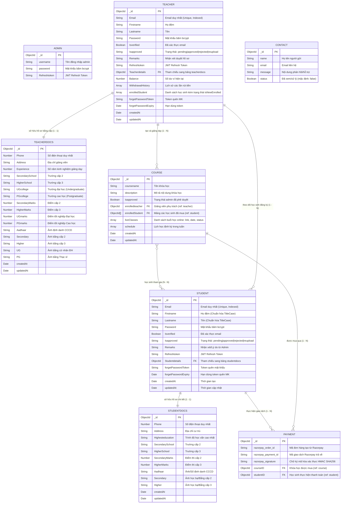

# 02. Biểu Đồ Quan Hệ Thực Thể (ERD - Entity Relationship Diagram)

Tài liệu này mô hình hóa toàn bộ cấu trúc và các mối quan hệ giữa các Collections trong cơ sở dữ liệu `eLearning`.

---

## 1. Biểu đồ ERD Chi tiết (Mermaid Diagram)

---

## 2. Diễn giải các Mối quan hệ chính (Relationships)

### 1. Quan hệ 1 - 1: Tài khoản người dùng và Hồ sơ pháp lý KYC
- **Student $\leftrightarrow$ Studentdocs:** Mỗi học sinh có một bản ghi chi tiết hồ sơ `studentdocs` liên kết qua trường `Studentdetails`.
- **Teacher $\leftrightarrow$ Teacherdocs:** Mỗi giáo viên có một bản ghi bằng cấp `teacherdocs` liên kết qua trường `Teacherdetails`.
- *Mục đích:* Phục vụ quy trình kiểm duyệt tài liệu (Admin vào duyệt bằng cấp/CCCD trước khi cho phép giảng viên mở bán khóa học hoặc học sinh tham gia học).

### 2. Quan hệ 1 - N: Giảng viên và Khóa học (Teacher $\rightarrow$ Course)
- Một giáo viên (`enrolledteacher`) có thể xuất bản nhiều khóa học khác nhau.
- Mỗi khóa học tại một thời điểm thuộc quyền sở hữu của một giảng viên phụ trách.

### 3. Quan hệ N - N: Học sinh và Khóa học (Student $\leftrightarrow$ Course)
- Một học sinh có thể ghi danh vào nhiều khóa học khác nhau.
- Một khóa học có một danh sách mảng chứa nhiều học sinh tham gia (`enrolledStudent: [ObjectId]`).

### 4. Quan hệ 1 - N: Giao dịch thanh toán (Student $\rightarrow$ Payment $\leftarrow$ Course)
- Bảng trung gian `payments` lưu vết mỗi khi học sinh thanh toán thành công qua Razorpay.
- Liên kết đồng thời với `studentID` (ai mua) và `courseID` (mua khóa học nào) cùng chữ ký mật mã `razorpay_signature` để bảo đảm tính toàn vẹn tài chính.
