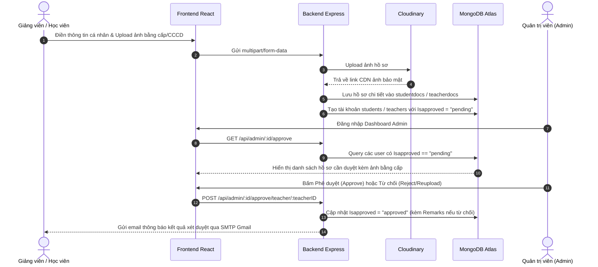
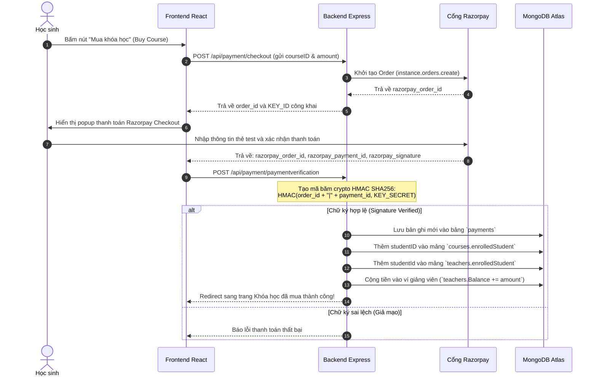
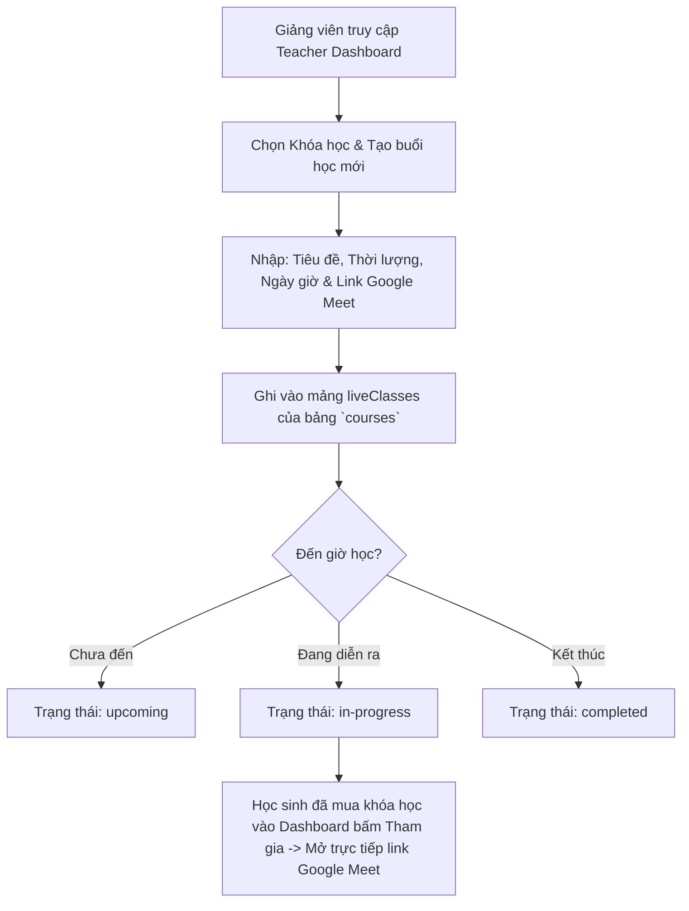

# 04. Luồng Nghiệp Vụ & Tương Tác Dữ Liệu

Tài liệu này mô tả cách thức dữ liệu di chuyển và được cập nhật giữa các bảng trong các tình huống thực tế của website.

---

## Luồng 1: Quy trình Đăng ký & Xét duyệt hồ sơ (KYC Approval)

Hệ thống yêu cầu cả Học sinh và Giảng viên phải qua bước kiểm duyệt hồ sơ để đảm bảo chất lượng và an toàn.

---

## Luồng 2: Mua Khóa học & Xác minh Thanh toán (Razorpay Checkout)

Đảm bảo tính toàn vẹn tài chính, chỉ mở quyền truy cập khóa học khi chữ ký mã hóa SHA256 trùng khớp 100%.

---

## Luồng 3: Quản lý Lớp học Trực tuyến (Live Classes)

Giảng viên lên lịch học trực tiếp tương tác 2 chiều với học sinh:

---

## Luồng 4: Cơ chế Bảo mật Phiên làm việc (JWT Authentication)

1. **Khi Đăng nhập thành công:**
   - Server tạo ra 2 Token:
     - **`AccessToken`** (thời hạn 1 ngày): Kèm trong response header/cookie để xác thực mỗi request API.
     - **`RefreshToken`** (thời hạn 10 ngày): Được lưu trực tiếp vào trường `Refreshtoken` trong bảng tương ứng (`admins`, `teachers`, `students`).
2. **Middleware bảo vệ Route:**
   - [adminAuth.middleware.js](file:///c:/Project/e-Learning-Platform/backend/src/middlewares/adminAuth.middleware.js)
   - [teacherAuth.middleware.js](file:///c:/Project/e-Learning-Platform/backend/src/middlewares/teacherAuth.middleware.js)
   - [stdAuth.middleware.js](file:///c:/Project/e-Learning-Platform/backend/src/middlewares/stdAuth.middleware.js)
   - Các middleware này giải mã AccessToken, tìm `_id` trong MongoDB để xác minh danh tính và phân quyền chuẩn xác trước khi cho phép thực thi tác vụ.
