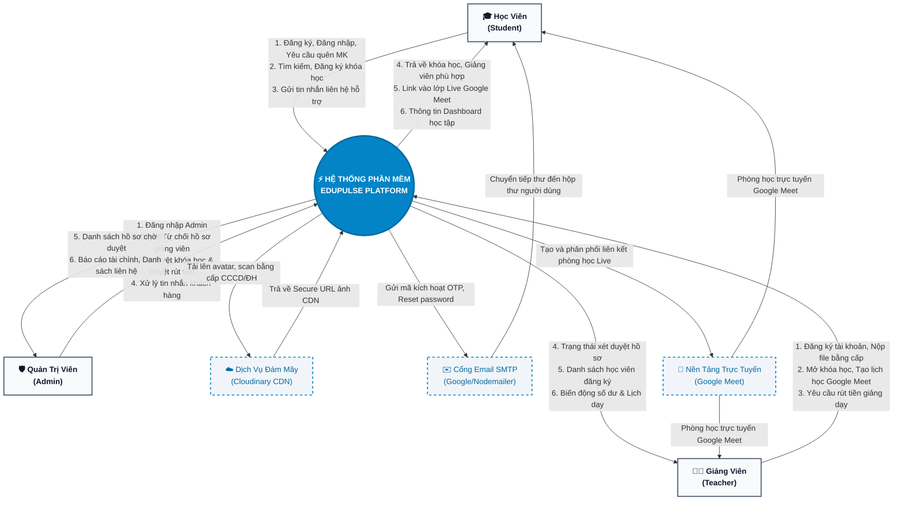

# TÀI LIỆU PHÂN TÍCH HỆ THỐNG EDUPULSE
**Đơn vị phát triển:** EduPulse Team  
**Trụ sở chính:** 99 Tô Hiến Thành, Phước Mỹ, Sơn Trà, TP. Đà Nẵng  
**Phiên bản tài liệu:** 1.0 (Năm 2026)

---

## 1. LÝ DO RA ĐỜI CỦA ỨNG DỤNG EDUPULSE

### 1.1. Bối cảnh thực tiễn của giáo dục trực tuyến tại Việt Nam
Trong kỷ nguyên số hóa, nhu cầu học tập nâng cao, luyện thi chứng chỉ quốc tế và tiếp cận tri thức chuyên sâu ngày càng bùng nổ trên khắp cả nước. Tuy nhiên, thị trường giáo dục trực tuyến hiện nay đang tồn tại những rào cản lớn:
1. **Mô hình học thụ động qua video quay sẵn (Pre-recorded Videos):** Đa phần các nền tảng phổ biến hiện nay chỉ cung cấp video thu hình sẵn. Tỉ lệ bỏ dở khóa học lên đến hơn 85% do học viên thiếu động lực, không có môi trường tương tác và không được giải đáp khúc mắc kịp thời.
2. **Khoảng cách địa lý và sự bất bình đẳng trong tiếp cận giảng viên giỏi:** Các giáo sư, chuyên gia đầu ngành thường tập trung ở các thành phố lớn hoặc các trường đại học trọng điểm. Người học ở các tỉnh thành (đặc biệt là khu vực miền Trung, Tây Nguyên) rất khó tìm được người thầy hướng dẫn trực tiếp, có chuyên môn sâu.
3. **Vấn nạn "khóa học rác" và giảng viên không được kiểm chứng:** Tình trạng khóa học kém chất lượng, người dạy không có chứng chỉ, bằng cấp minh bạch gây lãng phí tiền bạc và thời gian của học viên.

### 1.2. Sứ mệnh và Giải pháp của EduPulse
EduPulse ra đời với định vị là **Nền tảng học tập trực tuyến tương tác thực tế kết nối chuyên gia đầu ngành**, giải quyết triệt để các vấn đề trên thông qua 4 trụ cột:
- **Tương tác 2 chiều thời gian thực (Live Mentoring):** Tích hợp trực tiếp lớp học Google Meet bản quyền chất lượng cao, kết hợp lịch học cố định, học viên được hỏi - đáp trực tiếp với người dạy.
- **Thẩm định hồ sơ giảng viên nghiêm ngặt:** 100% giảng viên khi đăng ký bắt buộc phải nộp bằng cấp (Đại học, Thạc sĩ, Tiến sĩ), giấy tờ chứng nhận kinh nghiệm giảng dạy và phải được Admin duyệt danh tính trước khi mở lớp.
- **Minh bạch thông tin & đánh giá thực chất:** Mọi thông tin bằng cấp, quá trình đào tạo của giảng viên đều được hiển thị công khai để học viên và phụ huynh an tâm lựa chọn.
- **Trung tâm học thuật đặt tại Đà Nẵng:** Với trụ sở chính tại **99 Tô Hiến Thành, TP. Đà Nẵng** — thành phố đáng sống và là trung tâm đổi mới sáng tạo năng động của miền Trung — EduPulse định hướng mở rộng cơ hội học tập chất lượng cao cho mọi người học trên toàn quốc.

---

## 2. CÁC PHÂN HỆ VÀ CHỨC NĂNG CỦA PHẦN MỀM

Hệ thống EduPulse được kiến trúc thành 3 phân hệ người dùng chính cùng các dịch vụ nền tảng tích hợp:

```
                                  ┌────────────────────────┐
                                  │   HỆ THỐNG EDUPULSE    │
                                  └───────────┬────────────┘
         ┌────────────────────────────────────┼────────────────────────────────────┐
         ▼                                    ▼                                    ▼
┌─────────────────┐                  ┌─────────────────┐                  ┌─────────────────┐
│ PHÂN HỆ HỌC VIÊN│                  │PHÂN HỆ GIẢNG VIÊN│                  │  PHÂN HỆ ADMIN  │
└─────────────────┘                  └─────────────────┘                  └─────────────────┘
```

### 2.1. Phân Hệ Học Viên (Student Subsystem)
1. **Quản lý Tài Khoản & Bảo Mật:**
   - Đăng ký tài khoản mới bằng Email, mật khẩu được băm bảo mật qua Bcrypt.
   - Xác thực Email kích hoạt tài khoản thông qua liên kết OTP gửi tự động.
   - Đăng nhập, ghi nhớ phiên làm việc an toàn với JSON Web Token (Access Token & Refresh Token) lưu trong HttpOnly Cookie.
   - Quên mật khẩu & Đặt lại mật khẩu an toàn qua Email.
2. **Khám Phá & Tìm Kiếm Khóa Học:**
   - Duyệt danh mục khóa học đa dạng: Toán, Vật Lý, Hóa Học, Sinh Học, Lập trình & AI, Tiếng Anh IELTS, Tài chính kinh tế.
   - Bộ lọc theo môn học, cấp độ học và tìm kiếm thời gian thực theo từ khóa.
   - Xem chi tiết thông tin giảng viên: Ảnh đại diện Cloudinary, học vị, trường đào tạo, kinh nghiệm công tác.
3. **Tham Gia Lớp Học Trực Tuyến:**
   - Xem lịch học trực tiếp (Google Meet link, ngày giờ buổi học, thời lượng).
   - Truy cập phòng học trực tuyến chỉ với 1 cú nhấp chuột.
4. **Trang Cá Nhân & Quản Trị Học Tập (Student Dashboard):**
   - Theo dõi danh sách khóa học đang theo học.
   - Xem lịch sử đăng ký và tiến trình lớp học sắp diễn ra.
   - Cập nhật thông tin cá nhân và ảnh đại diện.

### 2.2. Phân Hệ Giảng Viên (Teacher Subsystem)
1. **Đăng Ký & Nộp Hồ Sơ Thẩm Định (Onboarding & Verification):**
   - Đăng ký tài khoản giảng viên với thông tin học thuật chi tiết.
   - Tải lên các văn bằng chứng chỉ: CCCD/Hộ chiếu, Bằng THPT, Bằng Cử nhân (UG), Bằng Thạc sĩ/Tiến sĩ (PG). Toàn bộ hồ sơ được tải lên đám mây Cloudinary an toàn.
   - Trạng thái tài khoản: `pending` (Chờ xét duyệt) -> `approved` (Đã duyệt) hoặc `rejected` (Từ chối).
2. **Quản Trị Lớp Học & Khóa Học (Teaching Management):**
   - Mở lớp học theo môn chuyên môn phụ trách.
   - Thiết lập lịch học theo tuần và tạo phòng học Google Meet tương tác trực tiếp.
   - Quản lý học viên đăng ký vào khóa học của mình.
3. **Bảng Điều Khiển Giảng Viên (Teacher Dashboard):**
   - Theo dõi số dư thu nhập giảng dạy (`Balance`).
   - Lập yêu cầu rút tiền về tài khoản ngân hàng cá nhân.
   - Cập nhật thông tin cá nhân, tiểu sử giảng dạy và ảnh đại diện.

### 2.3. Phân Hệ Quản Trị Viên (Admin Subsystem)
1. **Thẩm Định & Phê Duyệt Hồ Sơ Giảng Viên:**
   - Xem danh sách giảng viên đang chờ duyệt (`isapproved: "pending"`).
   - Kiểm tra trực tiếp các file scan văn bằng, chứng chỉ đại học/sau đại học lưu trên Cloudinary.
   - Thao tác: Phê duyệt (`approved`) hoặc Từ chối kèm lý do (`rejected`).
2. **Kiểm Duyệt & Quản Lý Khóa Học:**
   - Xem xét nội dung mô tả khóa học và giáo trình của giảng viên đề xuất.
   - Kích hoạt hoặc tạm dừng hiển thị khóa học trên trang chủ.
3. **Quản Lý Yêu Cầu Rút Tiền (Withdrawal Management):**
   - Kiểm tra yêu cầu rút tiền của giảng viên, đối soát tài chính và xác nhận chi trả.
4. **Hòm Thư Hỗ Trợ & Phản Hồi (Contact Management):**
   - Tiếp nhận tin nhắn từ biểu mẫu Liên Hệ của người dùng.
   - Trả lời hỗ trợ học vụ, giải quyết khiếu nại của học viên và phụ huynh.

### 2.4. Phân Hệ Dịch Vụ Nền Tảng (Core Integrations)
- **Cloudinary CDN:** Lưu trữ tập trung toàn bộ hình ảnh avatar và file hồ sơ bằng cấp với URL bảo mật, tối ưu tốc độ tải ảnh toàn cầu.
- **Google Meet API / Link Integration:** Cung cấp hạ tầng lớp học trực tuyến mượt mà, hỗ trợ chia sẻ màn hình, bảng vẽ điện tử.
- **Nodemailer SMTP:** Gửi email kích hoạt, khôi phục mật khẩu và thông báo lịch học tự động.
- **MongoDB Atlas:** Cơ sở dữ liệu phân tán NoSQL tốc độ cao, đảm bảo lưu trữ toàn vẹn dữ liệu.

---

## 3. SƠ ĐỒ NGỮ CẢNH HỆ THỐNG (CONTEXT DIAGRAM - DFD MỨC 0)

Sơ đồ ngữ cảnh thể hiện biên giới của hệ thống EduPulse với các tác nhân bên ngoài (Entities) và các luồng thông tin trao đổi:



### Giải Thích Luồng Dữ Liệu (Data Flows)

| Tác nhân | Dữ liệu Gửi vào Hệ thống (Inputs) | Dữ liệu Hệ thống Phản hồi (Outputs) |
| :--- | :--- | :--- |
| **Học Viên (Student)** | - Thông tin tài khoản, email, mật khẩu.<br/>- Từ khóa tìm kiếm khóa học.<br/>- Đăng ký tham gia khóa học/lớp live.<br/>- Tin nhắn gửi qua form liên hệ. | - Danh sách khóa học & chi tiết giảng viên.<br/>- Token xác thực đăng nhập (JWT).<br/>- Đường dẫn phòng học trực tiếp Google Meet.<br/>- Bảng điều khiển lộ trình học tập cá nhân. |
| **Giảng Viên (Teacher)** | - Thông tin chuyên môn, số điện thoại, địa chỉ.<br/>- File ảnh chụp/scan bằng cử nhân, thạc sĩ, tiến sĩ, CCCD.<br/>- Thông tin lớp học, lịch học trong tuần, link Meet.<br/>- Yêu cầu rút tiền thù lao giảng dạy. | - Kết quả thẩm định hồ sơ (Approved/Pending/Rejected).<br/>- Danh sách học viên tham gia lớp.<br/>- Thống kê doanh thu và xác nhận lệnh rút tiền. |
| **Quản Trị Viên (Admin)** | - Quyết định duyệt/từ chối hồ sơ giảng viên kèm ghi chú.<br/>- Lệnh duyệt/hủy khóa học.<br/>- Quyết định xác nhận chi trả tiền rút của giảng viên. | - Báo cáo tổng thể: số giảng viên chờ duyệt, khóa học mới.<br/>- Chi tiết hồ sơ bằng cấp của giảng viên để đối soát.<br/>- Danh sách tin nhắn liên hệ từ học viên. |
| **Hạ Tầng Tích Hợp (Services)** | - Cloudinary: Cung cấp Secure CDN URLs cho ảnh.<br/>- Email SMTP: Báo cáo trạng thái gửi mail thành công/thất bại.<br/>- Google Meet: Nền tảng luồng video tương tác thời gian thực. | - Hệ thống đẩy file nhị phân ảnh lên Cloudinary.<br/>- Hệ thống chuyển payload nội dung email sang SMTP server. |
