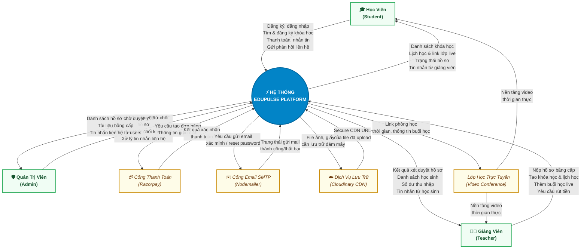
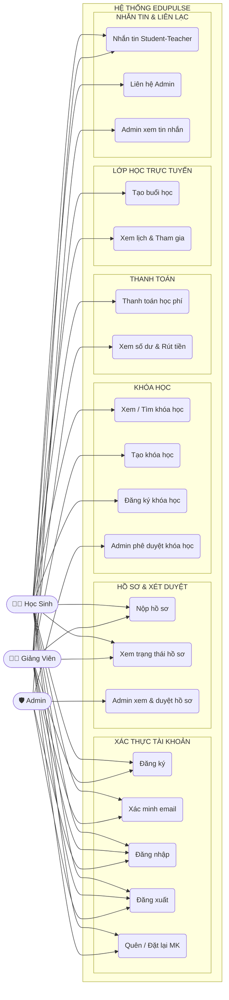
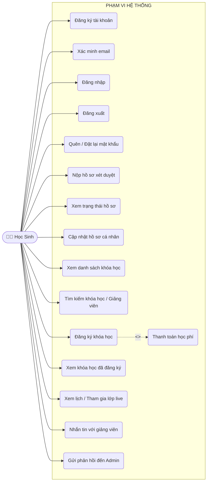
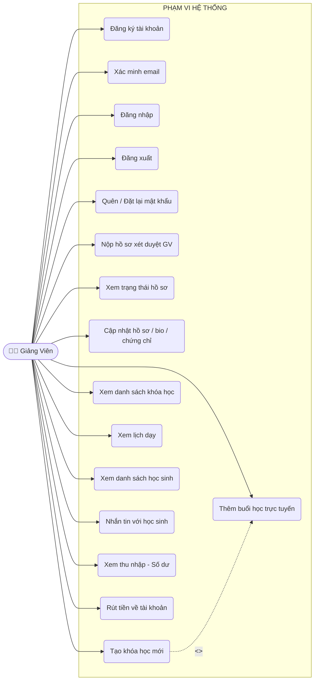
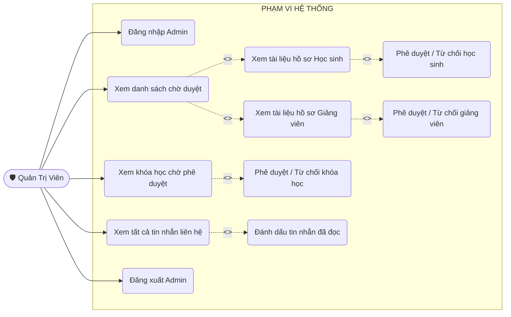
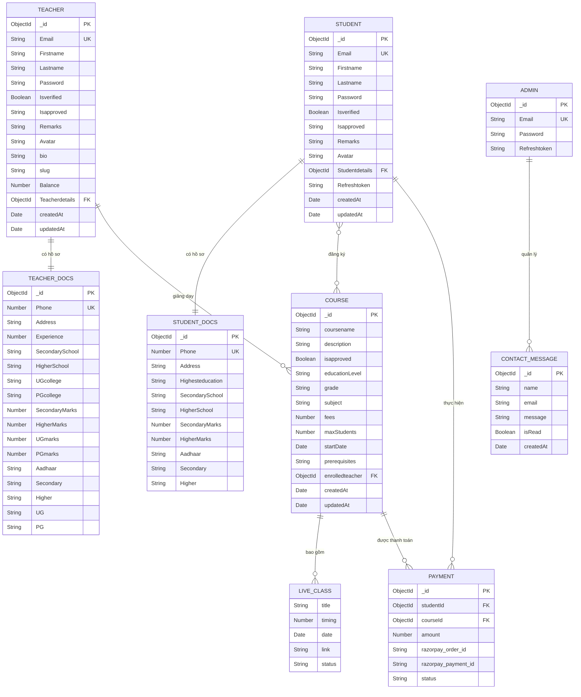

# TÀI LIỆU ĐẶC TẢ HỆ THỐNG
# EDUPULSE — NỀN TẢNG HỌC TRỰC TUYẾN

**Đơn vị phát triển:** EduPulse Team  
**Trụ sở chính:** 99 Tô Hiến Thành, Phước Mỹ, Sơn Trà, TP. Đà Nẵng  
**Phiên bản tài liệu:** 1.0 (Năm 2026)  
**Công nghệ:** MERN Stack (MongoDB, Express.js, React + Vite, Node.js)

---

## MỤC LỤC

1. [Lý do ra đời của ứng dụng](#1-lý-do-ra-đời-của-ứng-dụng)
2. [Các chức năng của phần mềm](#2-các-chức-năng-của-phần-mềm)
3. [Sơ đồ ngữ cảnh của phần mềm](#3-sơ-đồ-ngữ-cảnh-của-phần-mềm)
4. [Sơ đồ Use Case](#4-sơ-đồ-use-case)
5. [Đặc tả Use Case chi tiết](#5-đặc-tả-use-case-chi-tiết)
6. [Mô hình dữ liệu](#6-mô-hình-dữ-liệu)

---

## 1. LÝ DO RA ĐỜI CỦA ỨNG DỤNG

### 1.1 Bối cảnh thực tiễn của giáo dục trực tuyến tại Việt Nam

Trong kỷ nguyên số hóa, nhu cầu học tập nâng cao, luyện thi chứng chỉ quốc tế và tiếp cận tri thức chuyên sâu ngày càng bùng nổ trên khắp cả nước. Tuy nhiên, thị trường giáo dục trực tuyến hiện nay đang tồn tại những rào cản lớn:

| Vấn đề | Mô tả |
|--------|-------|
| **Học thụ động qua video quay sẵn** | Đa phần nền tảng chỉ cung cấp video thu hình sẵn. Tỉ lệ bỏ dở khóa học lên đến hơn 85% do học viên thiếu động lực, không được giải đáp kịp thời |
| **Khoảng cách địa lý** | Giáo sư, chuyên gia đầu ngành tập trung ở thành phố lớn. Người học ở tỉnh thành miền Trung, Tây Nguyên khó tìm được người thầy có chuyên môn sâu |
| **Giảng viên không được kiểm chứng** | Tình trạng khóa học kém chất lượng, người dạy không có chứng chỉ minh bạch gây lãng phí tiền bạc và thời gian học viên |
| **Thiếu tính tương tác** | Không có cơ chế hỏi đáp trực tiếp, học sinh không được hỗ trợ ngay khi gặp khó khăn |
| **Thanh toán thiếu an toàn** | Nhiều nền tảng không có cổng thanh toán được bảo mật, dễ phát sinh tranh chấp |

### 1.2 Sứ mệnh và Giải pháp của EduPulse

**EduPulse** ra đời với định vị là **Nền tảng học tập trực tuyến tương tác thực tế — kết nối chuyên gia đầu ngành với học viên trên toàn quốc**, giải quyết triệt để các vấn đề trên thông qua 4 trụ cột:

- **Tương tác 2 chiều thời gian thực (Live Mentoring):** Tích hợp lớp học trực tuyến với lịch học cố định, học viên được hỏi đáp trực tiếp với người dạy
- **Thẩm định hồ sơ giảng viên nghiêm ngặt:** 100% giảng viên phải nộp bằng cấp (ĐH, Thạc sĩ, Tiến sĩ), giấy tờ chứng nhận và được Admin duyệt trước khi mở lớp
- **Minh bạch thông tin & đánh giá thực chất:** Toàn bộ bằng cấp, quá trình đào tạo của giảng viên được hiển thị công khai
- **Thanh toán bảo mật qua Razorpay:** Đảm bảo giao dịch an toàn, học phí được quản lý minh bạch

### 1.3 Đối tượng sử dụng mục tiêu

| Đối tượng | Mô tả |
|-----------|-------|
| **Học sinh / Học viên (Student)** | Học sinh từ tiểu học đến đại học, người đi làm muốn học thêm kỹ năng và nâng cao kiến thức |
| **Giảng viên (Teacher)** | Giáo viên, gia sư, chuyên gia muốn chia sẻ kiến thức, mở lớp trực tuyến và tạo thu nhập |
| **Quản trị viên (Admin)** | Nhân viên nền tảng EduPulse quản lý nội dung, xét duyệt hồ sơ và kiểm soát chất lượng |

---

## 2. CÁC CHỨC NĂNG CỦA PHẦN MỀM

Hệ thống EduPulse được kiến trúc thành **3 phân hệ người dùng** chính cùng các dịch vụ nền tảng tích hợp.

### 2.1 Chức năng chung (Tất cả người dùng)

| STT | Mã CN | Chức năng | Mô tả |
|-----|-------|-----------|-------|
| 1 | CN01 | Đăng ký tài khoản | Tạo tài khoản mới với email và mật khẩu (mã hóa Bcrypt) |
| 2 | CN02 | Xác minh email | Xác nhận địa chỉ email qua link kích hoạt OTP gửi tự động |
| 3 | CN03 | Đăng nhập | Xác thực bằng JWT (Access Token + Refresh Token lưu HttpOnly Cookie) |
| 4 | CN04 | Đăng xuất | Hủy phiên đăng nhập, xóa token |
| 5 | CN05 | Quên mật khẩu | Gửi email đặt lại mật khẩu (token hết hạn sau 15 phút) |
| 6 | CN06 | Đặt lại mật khẩu | Nhập mật khẩu mới thông qua token hợp lệ |
| 7 | CN07 | Xem danh sách khóa học | Duyệt tất cả khóa học đã được Admin phê duyệt |
| 8 | CN08 | Xem hồ sơ giảng viên | Xem thông tin công khai: bio, chứng chỉ, bằng cấp, khóa học |
| 9 | CN09 | Liên hệ hệ thống | Gửi tin nhắn phản hồi/khiếu nại đến Admin qua form Contact Us |

### 2.2 Phân hệ Học sinh (Student Subsystem)

| STT | Mã CN | Chức năng | Mô tả |
|-----|-------|-----------|-------|
| 10 | CN10 | Nộp hồ sơ xét duyệt | Upload giấy tờ xác minh: CMND/CCCD, bằng THPT, bằng Đại học |
| 11 | CN11 | Xem trạng thái xét duyệt | Theo dõi trạng thái hồ sơ: pending / approved / rejected / reupload |
| 12 | CN12 | Cập nhật hồ sơ cá nhân | Chỉnh sửa thông tin cá nhân, ảnh đại diện |
| 13 | CN13 | Tìm kiếm khóa học | Tìm theo tên khóa học, cấp học, lớp, môn học |
| 14 | CN14 | Tìm kiếm giảng viên | Tìm và xem chi tiết hồ sơ giảng viên |
| 15 | CN15 | Đăng ký khóa học | Đăng ký tham gia khóa học (miễn phí hoặc trả phí) |
| 16 | CN16 | Thanh toán học phí | Thanh toán trực tuyến an toàn qua cổng Razorpay |
| 17 | CN17 | Xem khóa học đã đăng ký | Danh sách tất cả khóa học đang tham gia |
| 18 | CN18 | Xem lịch học / buổi học | Xem danh sách các buổi học trực tuyến sắp tới |
| 19 | CN19 | Tham gia lớp học trực tuyến | Truy cập link video conferencing để vào lớp live |
| 20 | CN20 | Nhắn tin với giảng viên | Gửi/nhận tin nhắn riêng với giảng viên của mình |

### 2.3 Phân hệ Giảng viên (Teacher Subsystem)

| STT | Mã CN | Chức năng | Mô tả |
|-----|-------|-----------|-------|
| 21 | CN21 | Nộp hồ sơ xét duyệt | Upload hồ sơ: CMND, bằng THPT, Cử nhân (UG), Thạc sĩ/Tiến sĩ (PG) |
| 22 | CN22 | Cập nhật hồ sơ cá nhân | Chỉnh sửa thông tin, tiểu sử (bio), ảnh đại diện, chứng chỉ |
| 23 | CN23 | Tạo khóa học mới | Tạo khóa học với: tên, mô tả, cấp học, lớp, môn học, học phí, lịch học, syllabus, kết quả đầu ra |
| 24 | CN24 | Xem danh sách khóa học | Quản lý tất cả khóa học đang giảng dạy |
| 25 | CN25 | Thêm buổi học trực tuyến | Tạo lịch buổi học mới kèm link video, ngày giờ, thời lượng |
| 26 | CN26 | Xem danh sách học sinh | Theo dõi danh sách học sinh đã đăng ký khóa học |
| 27 | CN27 | Xem lịch dạy | Quản lý lịch dạy theo tuần/buổi |
| 28 | CN28 | Nhắn tin với học sinh | Giao tiếp trực tiếp với học sinh trong nền tảng |
| 29 | CN29 | Xem thu nhập | Xem số dư tài khoản từ học phí thu được |
| 30 | CN30 | Rút tiền | Yêu cầu rút số dư về tài khoản ngân hàng cá nhân |

### 2.4 Phân hệ Quản trị viên (Admin Subsystem)

| STT | Mã CN | Chức năng | Mô tả |
|-----|-------|-----------|-------|
| 31 | CN31 | Đăng nhập Admin | Xác thực quản trị viên qua tài khoản riêng biệt |
| 32 | CN32 | Xem danh sách chờ xét duyệt | Xem toàn bộ hồ sơ học sinh/giảng viên đang chờ phê duyệt |
| 33 | CN33 | Xem tài liệu hồ sơ học sinh | Kiểm tra giấy tờ, bằng cấp nộp lên của học sinh |
| 34 | CN34 | Phê duyệt / Từ chối học sinh | Cập nhật trạng thái: approved / rejected / reupload kèm ghi chú |
| 35 | CN35 | Xem tài liệu hồ sơ giảng viên | Kiểm tra bằng cấp, chứng chỉ của giảng viên |
| 36 | CN36 | Phê duyệt / Từ chối giảng viên | Cập nhật trạng thái xét duyệt giảng viên |
| 37 | CN37 | Xem khóa học chờ phê duyệt | Danh sách khóa học do giảng viên tạo, chờ Admin duyệt |
| 38 | CN38 | Phê duyệt / Từ chối khóa học | Cho phép hoặc từ chối khóa học xuất hiện trên nền tảng |
| 39 | CN39 | Xem tin nhắn liên hệ | Đọc tất cả phản hồi, khiếu nại từ người dùng |
| 40 | CN40 | Đánh dấu đã đọc tin nhắn | Cập nhật trạng thái đọc cho tin nhắn liên hệ |
| 41 | CN41 | Đăng xuất Admin | Kết thúc phiên làm việc quản trị |

### 2.5 Phân cấp chức năng tổng thể

```
                         EDUPULSE PLATFORM
                               |
     _____________________________|__________________________________
     |                           |                                  |
PHÂN HỆ HỌC SINH         PHÂN HỆ GIẢNG VIÊN             PHÂN HỆ ADMIN
     |                           |                                  |
  - Xác thực                  - Xác thực                     - Xác thực
  - Nộp hồ sơ                 - Nộp hồ sơ                   - Quản lý hồ sơ
  - Tìm khóa học              - Tạo khóa học                 - Duyệt khóa học
  - Đăng ký & Thanh toán      - Quản lý lớp học              - Quản lý tin nhắn
  - Tham gia lớp live         - Xem thu nhập & Rút tiền      - Kiểm soát hệ thống
  - Nhắn tin                  - Nhắn tin
```

---

## 3. SƠ ĐỒ NGỮ CẢNH CỦA PHẦN MỀM

### 3.1 Mô tả tổng quan

Sơ đồ ngữ cảnh (Context Diagram — DFD Mức 0) thể hiện biên giới của hệ thống EduPulse với các **tác nhân bên ngoài** và các **luồng thông tin** trao đổi. Hệ thống được coi như một hộp đen (black box), chỉ mô tả WhatIN và WhatOUT.

### 3.2 Sơ đồ ngữ cảnh (DFD Level 0)



### 3.3 Bảng mô tả luồng dữ liệu ngữ cảnh

| Tác nhân | Dữ liệu gửi vào hệ thống (Inputs) | Dữ liệu hệ thống phản hồi (Outputs) |
|----------|-----------------------------------|--------------------------------------|
| **Học viên (Student)** | Thông tin tài khoản, hồ sơ xác minh, yêu cầu đăng ký khóa học, thông tin thanh toán, tin nhắn | Danh sách khóa học, lịch học, link lớp live, trạng thái hồ sơ, xác nhận thanh toán |
| **Giảng viên (Teacher)** | Hồ sơ bằng cấp, thông tin khóa học mới, lịch buổi học, yêu cầu rút tiền | Kết quả xét duyệt, danh sách học sinh, số dư thu nhập, tin nhắn |
| **Quản trị viên (Admin)** | Quyết định phê duyệt/từ chối hồ sơ và khóa học | Danh sách hồ sơ chờ duyệt, tài liệu bằng cấp, tin nhắn liên hệ |
| **Razorpay** | Kết quả xác nhận thanh toán | Yêu cầu tạo đơn hàng, thông tin giao dịch |
| **Email Service** | Trạng thái gửi email | Yêu cầu gửi email xác minh / đặt lại mật khẩu |
| **Cloudinary** | Secure CDN URL của file đã lưu | File hình ảnh, tài liệu cần upload lên đám mây |

---

## 4. SƠ ĐỒ USE CASE

### 4.1 Use Case tổng quát — Toàn hệ thống



### 4.2 Use Case chi tiết — Học sinh (Student)



### 4.3 Use Case chi tiết — Giảng viên (Teacher)



### 4.4 Use Case chi tiết — Quản trị viên (Admin)



---

## 5. ĐẶC TẢ USE CASE CHI TIẾT

### UC-11 — Đăng ký khóa học

| Trường | Nội dung |
|--------|----------|
| **Tên Use Case** | Đăng ký khóa học |
| **Mã** | UC-11 |
| **Tác nhân chính** | Học sinh (Student) |
| **Điều kiện tiên quyết** | Học sinh đã đăng nhập, hồ sơ được phê duyệt (`Isapproved = "approved"`) |
| **Điều kiện kết thúc (thành công)** | Học sinh được thêm vào `enrolledStudent[]` của khóa học |
| **Điều kiện kết thúc (thất bại)** | Không thay đổi dữ liệu, hiển thị thông báo lỗi |
| **Luồng chính** | 1. Học sinh duyệt danh sách khóa học công khai<br>2. Học sinh chọn khóa học muốn đăng ký<br>3. Hệ thống kiểm tra: đã đăng ký chưa, còn chỗ không, khóa học có được duyệt không<br>4a. Nếu khóa học miễn phí (`fees = 0`) → Thêm ngay vào danh sách<br>4b. Nếu khóa học tính phí → Chuyển sang UC-13 (Thanh toán)<br>5. Hệ thống xác nhận đăng ký thành công, cập nhật số học sinh |
| **Luồng thay thế** | 3a. Học sinh đã đăng ký → Thông báo "Bạn đã đăng ký khóa học này"<br>3b. Khóa học đạt `maxStudents` → Thông báo không thể đăng ký |
| **Ngoại lệ** | Học sinh chưa được phê duyệt (`Isapproved ≠ "approved"`) → Chuyển hướng trang thông báo |

---

### UC-10 — Tạo khóa học mới (Teacher)

| Trường | Nội dung |
|--------|----------|
| **Tên Use Case** | Tạo khóa học mới |
| **Mã** | UC-10 |
| **Tác nhân chính** | Giảng viên (Teacher) |
| **Điều kiện tiên quyết** | Giảng viên đã đăng nhập và được phê duyệt (`Isapproved = "approved"`) |
| **Điều kiện kết thúc (thành công)** | Khóa học được tạo với `isapproved = false`, chờ Admin duyệt |
| **Luồng chính** | 1. Giảng viên chọn "Tạo khóa học mới" trong Dashboard<br>2. Điền đầy đủ thông tin: tên, mô tả, cấp học (`educationLevel`), lớp (`grade`), môn học (`subject`), học phí, số học sinh tối đa, ngày khai giảng, lịch học theo tuần, syllabus, kết quả đầu ra, điều kiện tham gia<br>3. Xác nhận tạo khóa học<br>4. Hệ thống lưu khóa học với `isapproved = false`<br>5. Thông báo: "Khóa học đang chờ Admin phê duyệt" |
| **Luồng thay thế** | 3a. Thiếu thông tin bắt buộc → Validation error, giữ lại form |
| **Ngoại lệ** | Giảng viên chưa được phê duyệt → Không có quyền truy cập trang tạo khóa học |

---

### UC-08 — Phê duyệt hồ sơ (Admin)

| Trường | Nội dung |
|--------|----------|
| **Tên Use Case** | Phê duyệt / Từ chối hồ sơ người dùng |
| **Mã** | UC-08 |
| **Tác nhân chính** | Quản trị viên (Admin) |
| **Điều kiện tiên quyết** | Admin đã đăng nhập |
| **Điều kiện kết thúc** | `Isapproved` của học sinh/giảng viên được cập nhật trạng thái mới |
| **Luồng chính** | 1. Admin vào trang Quản lý hồ sơ chờ duyệt<br>2. Chọn xem chi tiết hồ sơ (CMND, bằng cấp được lưu trên Cloudinary)<br>3. Admin quyết định: Phê duyệt / Từ chối / Yêu cầu upload lại<br>4. Hệ thống cập nhật `Isapproved` và `Remarks` (nếu có ghi chú)<br>5. Người dùng thấy kết quả khi đăng nhập lại |
| **Luồng thay thế** | 3a. Yêu cầu reupload → Ghi lý do vào `Remarks`, cập nhật `Isapproved = "reupload"` |
| **Ngoại lệ** | Hồ sơ không tồn tại → Trả về lỗi 404 |

---

### UC-13 — Thanh toán học phí

| Trường | Nội dung |
|--------|----------|
| **Tên Use Case** | Thanh toán học phí |
| **Mã** | UC-13 |
| **Tác nhân chính** | Học sinh (Student) |
| **Tác nhân thứ hai** | Razorpay (cổng thanh toán bên ngoài) |
| **Điều kiện tiên quyết** | Học sinh đã chọn khóa học tính phí và được phê duyệt |
| **Điều kiện kết thúc (thành công)** | Thanh toán thành công: học sinh được đăng ký vào khóa học, số dư giảng viên tăng tương ứng |
| **Luồng chính** | 1. Hệ thống tạo đơn hàng Razorpay (`razorpay_order_id`)<br>2. Học sinh nhập thông tin thanh toán trên giao diện Razorpay<br>3. Razorpay xử lý giao dịch<br>4. Razorpay trả về kết quả xác nhận thành công<br>5. Hệ thống xác minh chữ ký (`razorpay_payment_id`), ghi nhận Payment<br>6. Học sinh được thêm vào `enrolledStudent[]` của khóa học<br>7. Số dư (`Balance`) của giảng viên được cộng thêm |
| **Luồng thay thế** | 4a. Giao dịch thất bại → Không đăng ký khóa học, hiển thị thông báo lỗi |
| **Ngoại lệ** | Timeout kết nối Razorpay → Giao dịch bị hủy, hoàn tiền tự động |

---

### UC-15 — Tạo buổi học trực tuyến (Teacher)

| Trường | Nội dung |
|--------|----------|
| **Tên Use Case** | Tạo buổi học trực tuyến |
| **Mã** | UC-15 |
| **Tác nhân chính** | Giảng viên (Teacher) |
| **Điều kiện tiên quyết** | Giảng viên đã đăng nhập, có ít nhất 1 khóa học được phê duyệt |
| **Điều kiện kết thúc** | Buổi học được thêm vào `liveClasses[]` của khóa học với `status = "upcoming"` |
| **Luồng chính** | 1. Giảng viên vào trang quản lý khóa học cụ thể<br>2. Chọn "Thêm buổi học mới"<br>3. Điền thông tin: tiêu đề buổi học, ngày, giờ, thời lượng (phút), link video conferencing<br>4. Xác nhận tạo buổi học<br>5. Hệ thống lưu buổi học với `status = "upcoming"`<br>6. Học sinh đã đăng ký thấy buổi học trong danh sách lịch học |
| **Luồng thay thế** | 3a. Thiếu link video → Thông báo lỗi validation |
| **Ngoại lệ** | Khóa học không tồn tại hoặc chưa được duyệt → Lỗi 404 / 403 |

---

## 6. MÔ HÌNH DỮ LIỆU

### 6.1 Sơ đồ ERD



### 6.2 Mô tả các thực thể chính

| Thực thể | Vai trò | Trường quan trọng |
|----------|---------|-------------------|
| **STUDENT** | Học sinh sử dụng nền tảng | `Isapproved` (pending/approved/rejected/reupload), `Studentdetails` |
| **STUDENT_DOCS** | Hồ sơ, giấy tờ xác minh học sinh | `Aadhaar`, `Secondary`, `Higher` (Cloudinary URLs) |
| **TEACHER** | Giảng viên tạo và giảng dạy khóa học | `Balance` (thu nhập), `Isapproved`, `bio`, `slug` |
| **TEACHER_DOCS** | Hồ sơ, bằng cấp giảng viên | `Aadhaar`, `Secondary`, `Higher`, `UG`, `PG` (Cloudinary URLs) |
| **COURSE** | Khóa học trên nền tảng | `isapproved`, `educationLevel`, `liveClasses[]`, `schedule[]`, `enrolledStudent[]` |
| **LIVE_CLASS** | Buổi học trực tuyến (nhúng trong Course) | `link`, `date`, `timing`, `status` (upcoming/in-progress/completed) |
| **PAYMENT** | Ghi nhận giao dịch thanh toán | `razorpay_order_id`, `razorpay_payment_id`, `status` |
| **ADMIN** | Quản trị viên hệ thống | `Email`, `Password` |
| **CONTACT_MESSAGE** | Tin nhắn liên hệ từ người dùng | `isRead` (trạng thái đọc) |

### 6.3 Quy trình trạng thái hồ sơ

```
Người dùng đăng ký tài khoản
           |
           v
       [pending]  ────────────> Admin xem xét hồ sơ & bằng cấp
                                        |
                          +─────────────+─────────────+
                          |             |             |
                          v             v             v
                     [approved]    [rejected]    [reupload]
                          |                          |
                          v                          v
                  Truy cập đầy đủ         Upload lại giấy tờ
                   tính năng              và chờ duyệt lại
```

### 6.4 Quy trình phê duyệt khóa học

```
Giảng viên tạo khóa học
           |
           v
   isapproved = false (chờ duyệt)
           |
           v
   Admin xem xét nội dung khóa học
           |
           +────────> Phê duyệt: isapproved = true
           |               |
           |               v
           |        Khóa học xuất hiện
           |        trên trang công khai
           |
           +────────> Từ chối: isapproved = false
                           |
                           v
                    Khóa học không hiển thị
```

---

## PHỤ LỤC — CÔNG NGHỆ SỬ DỤNG

| Layer | Công nghệ | Mục đích |
|-------|-----------|----------|
| **Frontend** | React 18 + Vite | Giao diện người dùng, SPA động và responsive |
| **Routing** | React Router DOM | Điều hướng phía client theo vai trò |
| **State Management** | React Context API | Quản lý trạng thái đăng nhập, phiên làm việc |
| **Backend** | Node.js + Express.js | REST API, xử lý business logic |
| **Database** | MongoDB + Mongoose | Lưu trữ dữ liệu NoSQL, ODM |
| **Authentication** | JWT + bcrypt | Xác thực token, mã hóa mật khẩu |
| **File Storage** | Cloudinary + Multer | Lưu trữ ảnh đại diện, tài liệu bằng cấp |
| **Payment Gateway** | Razorpay | Cổng thanh toán trực tuyến bảo mật |
| **Email** | Nodemailer | Gửi email xác minh, đặt lại mật khẩu |
| **Validation** | Joi | Kiểm tra tính hợp lệ dữ liệu đầu vào |
| **Deployment** | Vercel | Triển khai frontend và backend lên cloud |

---

*Tài liệu đặc tả hệ thống EduPulse — Phiên bản 1.0*  
*Cập nhật lần cuối: 21/09/2026*  
*EduPulse Team — 99 Tô Hiến Thành, Phước Mỹ, Sơn Trà, TP. Đà Nẵng*
